# Storage for DBAs，系列博客

[Storage for DBAs](https://flashdba.com/storage-for-dbas/)

[Introduction](https://flashdba.com/2013/03/26/new-blog-series-storage-for-dbas/)

### [Storage Fundamentals](https://flashdba.com/category/storage-for-dbas/storage-fundamentals/)

- [Performance: It’s All About Balance](https://flashdba.com/2013/04/02/performance-its-all-about-balance/)
- [The Fundamental Characteristics of Storage](https://flashdba.com/2013/04/08/the-fundamental-characteristics-of-storage/)
- [Understanding I/O: Random vs Sequential](https://flashdba.com/2013/04/15/understanding-io-random-vs-sequential/) (The Sushi Effect!)
- [Does My Database Need Flash?](https://flashdba.com/2013/04/29/does-my-database-need-flash/)
- [The Most Important Thing You Need To Know About Flash](https://flashdba.com/2013/05/08/the-most-important-thing-you-need-to-know-about-flash/)

### [Storage Myths](https://flashdba.com/category/storage-for-dbas/storage-myths/):

[Storage Myths: IOPS Matter](https://flashdba.com/2013/06/27/storage-myths-iops-matter/)

[Storage Myths: Put Oracle Redo on SSD](https://flashdba.com/2013/08/22/storage-myths-put-oracle-redo-on-ssd/)

[Storage Myths: Dedupe for Databases](https://flashdba.com/2013/11/26/storage-myths-dedupe-for-databases/)

[Storage Myths: Storage Compression Has No Downside](https://flashdba.com/2013/12/17/storage-myths-storage-compression-has-no-downside/)

[Playing The Data Reduction Lottery](https://flashdba.com/2014/01/24/playing-the-data-reduction-lottery/)

### [Database Economics](https://flashdba.com/category/storage-for-dbas/database-economics/):

[The Real Cost of Enterprise Database Software](https://flashdba.com/2013/09/10/the-real-cost-of-enterprise-database-software/)

[The Real Cost of Oracle RAC](https://flashdba.com/2013/09/18/the-real-cost-of-oracle-rac/)

[The Most Expensive CPUs You Own](https://flashdba.com/2013/10/10/the-most-expensive-cpus-you-own/)

# [Understanding Disk](https://flashdba.com/category/storage-for-dbas/understanding-disk/)

[Understanding Disk: Superpowers](https://flashdba.com/2013/10/17/understanding-disk-superpowers/)

[Understanding Disk: Mechanical Limitations](https://flashdba.com/2013/10/28/understanding-disk-mechanical-limitations/)

[Understanding Disk: Over-Provisioning](https://flashdba.com/2013/11/08/understanding-disk-over-provisioning/)

[Understanding Disk: Caching and Tiering](https://flashdba.com/2014/05/23/understanding-disk-caching-and-tiering/)

# [Understanding Flash](https://flashdba.com/category/storage-for-dbas/understanding-flash/)

## ✅ [Understanding Flash: What Is NAND Flash?](https://flashdba.com/2014/06/06/understanding-flash-what-is-nand-flash/)

[Understanding Flash: What Is NAND Flash?](https://flashdba.com/2014/06/06/understanding-flash-what-is-nand-flash/)

- 20世纪80年代
- Dr Fujio Masuoka，Toshiba in Japan
- 从EPROM和EEPROM演变而来
    - EPROM密度高，但不能电擦除，every cell need one transistor
    - EEPROM密度低，但可以电擦除（次数限制，即寿命），every cell required at least two transistors
- US patent 4612212，结合两者特性
    - one transistor per cell
    - 支持电擦除，但要批量
        - only allowing multiple cells to be erased and programmed instead of individual cells
- Flash类型：
    - 按照密度，有SLC、MLC、TLC等
    - 按照类型有NOR和`NAND`
- 为什么叫flash？是因为相机的快门？

## ✅ [Understanding Flash: Blocks, Pages and Program / Erases](https://flashdba.com/2014/06/20/understanding-flash-blocks-pages-and-program-erases/)

[Understanding Flash: Blocks, Pages and Program / Erases](https://flashdba.com/2014/06/20/understanding-flash-blocks-pages-and-program-erases/)

- **Flash组织结构：**
    - Chip(Package)，多片
    - Die，每个package可包含1、2或4个die
    - Plane，每个die一般包含1或2个plane。Plane之间可以并行操作。
    - Block，block为erase操作的基本单位，耗时操作，一般4~8MB大小
    - Page，page是读写的基本单位，一般8~16KB大小，page由cell组成
        - 每个block可能含有128或256个page
    - 寿命问题：PE cycle次数有限制
    - 性能问题：擦除代价远大于读写
        - it takes many times longer to perform an erase than it does to perform a read or program.
    
    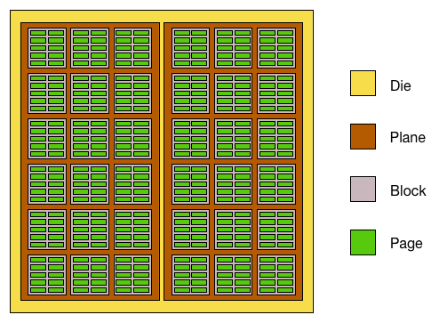
    
- Flash不支持原地更新，需要先擦除再写新数据。而擦除以block为单位，里面的所有valid pages都要拷贝，擦除完了再写回去。
    - 这样子代价高，一般是使用out-of-place update，也就是将旧的page置为invalid，然后在另外一个free page里写入新数据。
    - 这里需要一层映射，来跟踪数据在何方。这就是FTL的由来。
    
    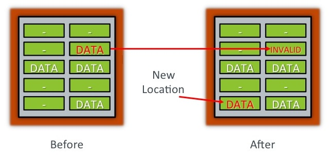
    
- 其实，block被擦除时是置为全1。写数据时是将对应的1写为0。

## ✅ [Understanding Flash: SLC, MLC and TLC](https://flashdba.com/2014/07/03/understanding-flash-slc-mlc-and-tlc/)

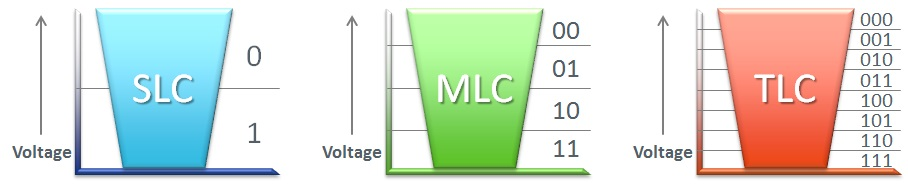

- SLC只需要将cell里的电容量（charge）二分比较即可（比如满了是0，空了是1），而MLC、TLC则需要更加精细的探测，错误的容忍度更低（lower margin of error），寿命也越小。

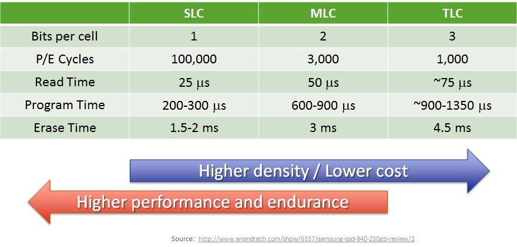

- 随着密度增大，读写擦除的时间都变大，寿命变小
- 注意擦除的时间，都在毫秒级别。一般来看，写比读慢10倍，擦除又比写慢10倍
- MLC最常使用，也有SLC与MLC混用。
- 这里谈到的还是2D flash，后来有了3D flash。

## ✅ [Understanding Flash: What is 3D NAND?](https://flashdba.com/2016/01/26/understanding-flash-what-is-3d-nand/)

- 二维的NAND如下所示：bitline与wordline

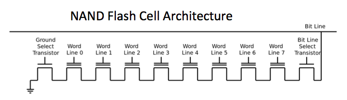

- 三维的NAND如下所示：平面再折叠成U字型。

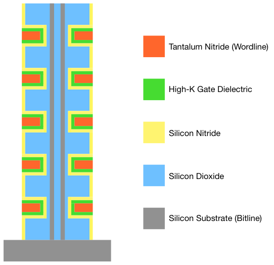

- 三星的V-NAND
    - 第一代有24层
    - 第二代有32层
    - 第三代有48层
- 层数限制没那么严格，所以扩展性好
- 3D NAND不再使用floating gate transistors，而是Charge Trap Flash。
    - 更好的endurance跟power consumption
    - 使用TLC甚至QLC。

## ✅ [Understanding Flash: The Flash Translation Layer](https://flashdba.com/2014/09/17/understanding-flash-the-flash-translation-layer/)

- FTL（Flash Translation Layer）职责：
    - write updated information to a new empty page and then *divert* all subsequent read requests to its new address，非原地更新，需要地址映射
    - ensure that newly-programmed pages are evenly distributed across all of the available flash so that it `wears evenly`，磨损均衡（需不需要考虑空间局部性？）
    - keep a list of all the old *`invalid`* pages so that at some point later on they can all be *recycled* ready for reuse，标记invalid页，用于回收
- **`Logical Block Mapping`**
    - 为什么叫block而不是page，因为磁盘比flash更早出现
    - 解决职责1，地址映射，LBA → PBA，对上层是透明的
    
    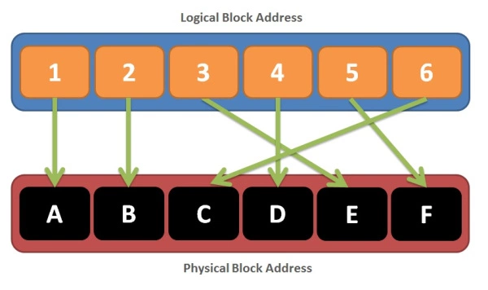
    
- **`Wear Leveling`**
    - 寿命问题，PE次数有限（会被写穿），需要均衡地写
    - 考虑冷热块问题，冷块一直不更新（寿命余额一直不变），而热块不停更新（寿命不停减小），加剧了磨损均衡问题。
    - 注意这里的块指的是物理块，而不是逻辑地址。也就是说，即使上层一直往一个逻辑地址写，底层可以分布到不同的物理块，照样可以保持均衡。
    - 为了保持均衡，那么有时候冷块需要挪窝，将这个块让出来以写数据。当然，挪窝（copy）又加剧了写的压力，相应地影响到寿命。这里有一个write balance。
- **`Garbage Collection`**
    - 每个block可能含有128或256个page，要回收其中的无效页，需要将其中的有效页迁移到别处，因为erase操作是以block为单位的。迁移涉及到额外写问题。
- **`Write Amplification`**
    - 额外写可能是由磨损均衡或者垃圾回收带来的。
    - 写放大系数越小越好。
    - 分母是Host主机真实发送的写的数量
    - 分子是Flash内部真实写的数量
    
    
    
- FTL在哪里？
    - 可以在flash本身的固件里（controller）
    - 可以在host主机上

## ✅ [Understanding Flash: Garbage Collection Matters](https://flashdba.com/2014/10/15/understanding-flash-garbage-collection-matters/)

- 假如一开始不进行垃圾回收（那就相当于变成了ROM）
    - 这时候想回收也回收不了，因为没有一个块有足够多的空闲页来容纳待移出的页
    
    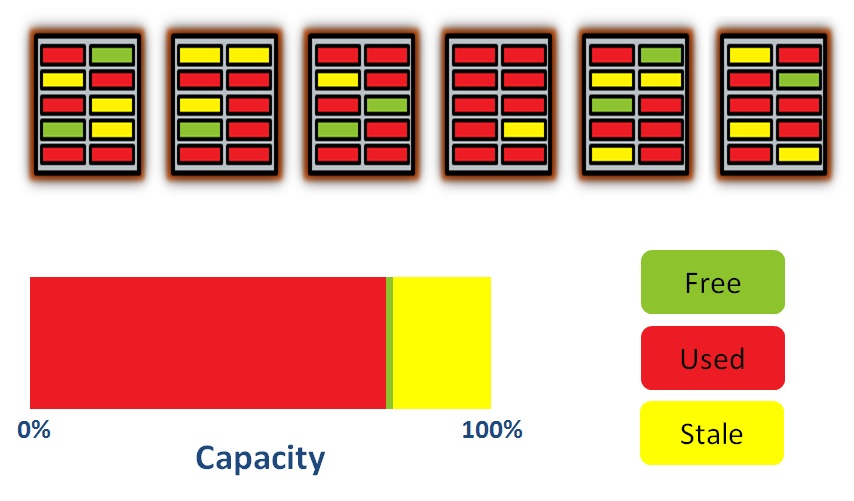
    
    - 使用Over-Provisioning，保证GC的顺利进行
    - 高端的flash可以让用户调整OP，比如workload是read intensive，那么可以减小OP的空间。
    
    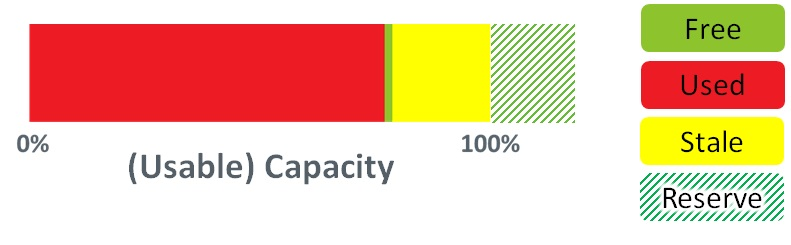
    

## [Understanding Flash: The Write Cliff](https://flashdba.com/2014/11/24/understanding-flash-the-write-cliff/)

- 关于performance，除了关注快之外，更关心predictability，可预测性。
- First of all, in general each flash die can only perform one operation at a time （或者说plane）
    - 比如某个die在做erase操作，那么后续的读写操作需要等待，即使针对的是不同的block
- The second bit of news is that erase operations are slow
    - 写比读慢10倍，擦除差不错又要比写慢10倍。
- 所以，会出现情况，读着读着，突然变慢了（甚至100呗？），从微秒级到毫秒级。

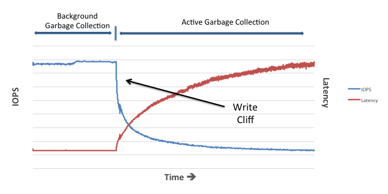

- 如果前台请求不够多，后台可以静悄悄地做垃圾回收（BGC）。
- 如果前台请求太快，后台来不及处理，那么请求只能排队，显式地前台做垃圾回收。
- OP只能延缓，并不能避免cliff。

## [Understanding Flash: Unpredictable Write Performance](https://flashdba.com/2014/12/10/understanding-flash-unpredictable-write-performance/)

- 一次写操作时间并不是固定的
- MLC中，写00和11是最快的，写01和10是需要慢工出细活的，需要精细地program，然后test写对了没有。
- MLC重编码
    - 低位LSB上半部分是0，下半部分是1。
    
    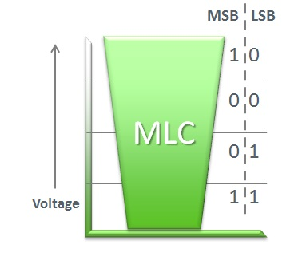
    
- fast page, slow page

## [Understanding Flash: Floating Gates and Wear](https://flashdba.com/2015/01/09/understanding-flash-floating-gates-and-wear/)

## [Understanding Flash: Fabrication, Shrinkage and the Next Big Thing](https://flashdba.com/2015/02/17/understanding-flash-fabrication-shrinkage-and-the-next-big-thing/)

## [Understanding Flash: Summary – NAND Flash Is A Royal Pain In The …](https://flashdba.com/2015/05/14/understanding-flash-summary-nand-flash-is-a-royal-pain-in-the-xxx/)

# [All Flash Arrays](https://flashdba.com/category/storage-for-dbas/all-flash-arrays/):

[All Flash Arrays: What Is An AFA?](https://flashdba.com/2015/06/25/all-flash-arrays-what-is-an-afa/)

[All Flash Arrays: Can’t I Just Stick Some SSDs In My Disk Array?](https://flashdba.com/2015/08/18/all-flash-arrays-cant-i-just-stick-some-ssds-in-my-disk-array/)

[All Flash Arrays: Where’s My Capacity? Effective, Usable and Raw Explained](https://flashdba.com/2015/10/06/all-flash-arrays-wheres-my-capacity-effective-usable-and-raw-explained/)

[All Flash Arrays: SSD-based versus Ground-Up Design](https://flashdba.com/2015/10/14/all-flash-arrays-ssd-based-versus-ground-up-design/)

[All Flash Arrays: Hybrid Means Compromise](https://flashdba.com/2016/01/07/all-flash-arrays-hybrid-means-compromise/)

[All Flash Arrays: Controllers Are The New Bottleneck](https://flashdba.com/2016/07/06/all-flash-arrays-controllers-are-the-new-bottleneck/)

[All Flash Arrays: Active/Active versus Active/Passive](https://flashdba.com/2016/10/19/all-flash-arrays-activeactive-versus-activepassive/)

[All Flash Arrays: Scale Up vs Scale Out (Part 1)](Part 1))

[All Flash Arrays: Scale Up vs Scale Out (Part 2)](Part 2))

[Flash Debrief](https://flashdba.com/2019/03/28/storage-for-dbas-the-end-part-1/):

[Flash Debrief: The End (Part 1)](Part 1))