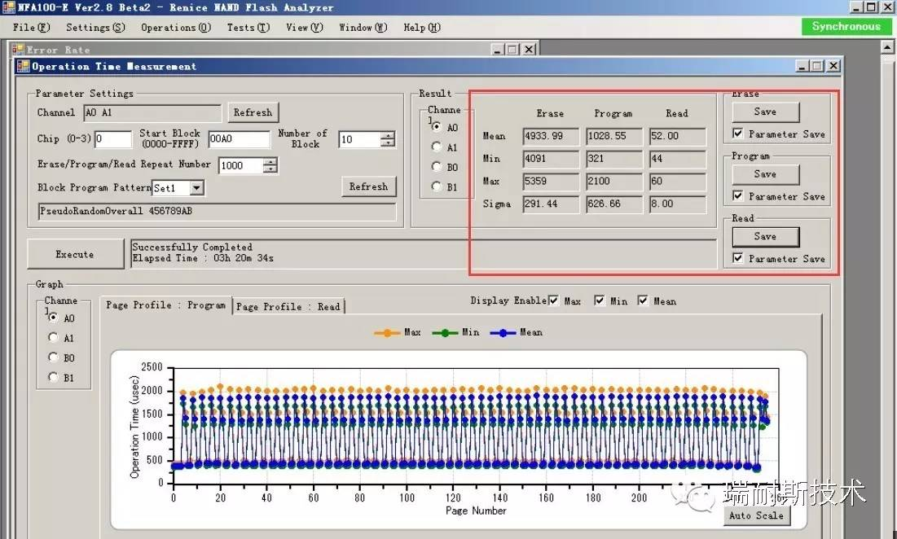
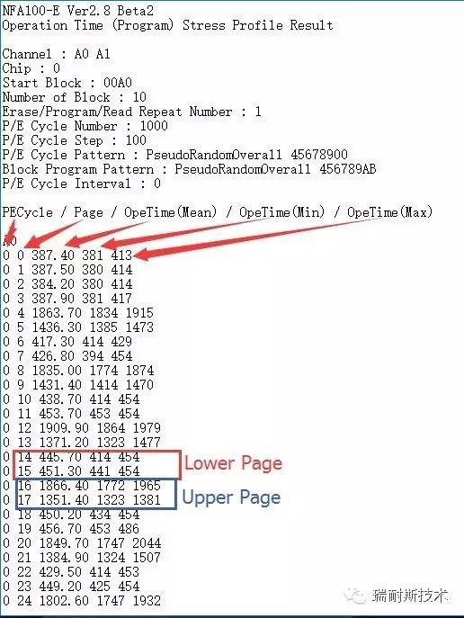
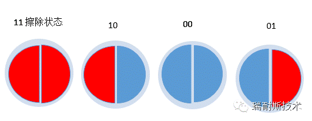
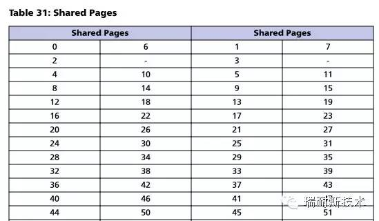
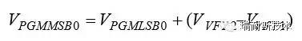
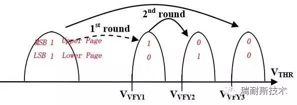
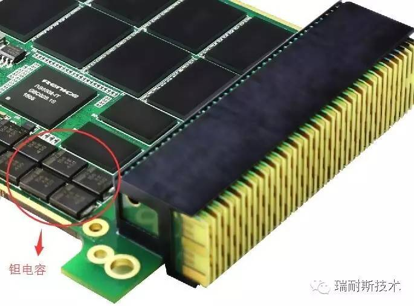

# Upper Page和Lower Page那些事儿

[Upper Page和Lower Page那些事儿](http://renice-tech.com/html/2016/09/19/201609190105362233212086.html)

根据Lower page和Upper page的不同特性解决不同的问题，在实际的应用中会带来极好的效果，如：提升性能、大幅提升寿命、解决异常掉电的可靠性安全隐患等等。一些特殊应用或许会带来其他方面的损失，如：提升性能和寿命可能需要牺牲容量等，但这些取舍的操作往往比通用的操作更具有现实意义。

Upper Page和Lower Page的概念在各个Nand Flash厂商的Datasheet中基本没有提及，Datasheet会给出笼统的program时间，这个操作时间是Lower和upper的平均时间，实际上，`Upper page的操作时间会比Lower Page的操作时间长3-4倍左右（MLC）`。这些结论可以通过NFA100-E很直观的看到：

最直接的测试数据（时间单位：μs）：

那么，到底操作时间短的叫Upper page，还是操作时间长的叫Upper page？Lower Page是所谓的“快页”还是“慢页”？

答案是：`Upper Page是操作时间较长的Page，也叫“慢页”；Lower Page是操作时间较短的Page，也叫“快页”。`为何如此，后文有分析。

## 关于LSB和MSB

在谈Upper page和Lower page之前，必须得从两个绕不开词说起：`LSB`（Least Significant Bit，最低有效位）和`MSB`（Most Significant Bit，最高有效位）。

MSB是指一个n位二进制数字中的n-1位，具有最高的权值2^(n-1)，在大端序中，MSB即指最左端的位，LSB则相反。

Nand Flash最初始的状态是“11”（擦除状态），在此状态下，左边的1是MSB，右边的1是LSB，所以，对Nand Flash进行Program的过程，就是将“11”中的MSB或者LSB或者二者Program为“0”或者继续保持“1”的状态。由此，cell其实有四种状态，四种状态分布对应不同的Cell电压值：

- 11：Erase状态；
- 10：Program 0（LSB被program）
- 00：Program 0（LSB和MSB被Program）
- 01：Program 0（MSB被program）

## Upper Page和Lower Page

那么，LSB和MSB和upper page和Lower page又是什么关系呢？

厂商是这样做的：`把MSB和LSB一个物理cell上的两个bit分别映射到两个不同的page上`，那么，LSB对应的page就是Lower page，MSB对应的page就是Upper page。美其名曰：shared pages或者paired pages，具体如何映射，每个厂商各有不同，每一代的Nand Flash的映射方法也不同，例如：34nm和25nm就不一定相同，2D Nand和3D Nand也不同，更为悲催的是，有些厂商在datasheet中并不提供对应的表供用户查询。

例如：page32和page64，page75和page138互为shared page，开头和结尾的一些pages（数量不确定，每个厂商都不同，2D nand和3D也不同）有特殊用途，没有分配shared page。

Datasheet没有说明这一对page中，哪个是Upper Page，哪个是Lower Page。事实上，数字小的是Lower Page，数字大的是Upper Page。

那么`为什么LowerPage的速度快，Upper page的速度慢呢？`这是因为，与Lower page不同，Upper Page在Program时，不仅仅需要自身的阈值电压，还需要知道Lower Page阈值电压分布情况，具体来说：

Nand Flash对一个cell的编程必须是从LSB也就是对应的Lower page开始执行编程，那么，LSB将会面临两种状态：

1、如果是写入“1”，Cell的阈值电压不会发生改变，仍然保持“擦除”状态；

2、如果是写入“0”，Vth将会升高，直到达到“10”或“00”所需的电压值。

LSB编程完毕，才开始MSB也就是Upper Page的编程，同样：

1、 如果是写入“1”，Vth不会发生改变，仍然保持擦除状态；

2、 如果是写入“0”，那么：

2.1 如果Lower page是“1”，Vth将会升高到“01”；

2.2 如果Lower page是“0”，将会升高到“00”所需电压值；

## 异常掉电的影响

正如上面所述，一个物理cell其实是被两个page所共享，那么，问题就来了，既然一个cell中的两个bit被映射到两个不同的逻辑页中，那么当对其中一个bit进行写入操作时（无论是MSB还是LSB），如果突然掉电，那么，这个cell中的数据势必会丢失，也就是说，两个page中的数据都会出现错误。所以，断电保护的作用就不言而喻。

通常情况下，SSD会使用`钽电容`或者超级电容做断电保护，二者各具优缺点，钽电容更适合宽温环境，但钽电容容量一般都较小，不适合做大容量SSD断电保护，超级电容则不适合高低温环境，更适合做大容量SSD断电保护。

## 总结

MLC的一个单元cell可存储两bit信息，LSB跟MSB，分别划分给lower page和upper page。所以逻辑上这是两个独立的页，但在物理上，它们其实是紧密相关的，共存于cell内。闪存block要求内部的页要按顺序写下来，一部分也是这个原因。要先写lower page，再写upper page。一开始是被擦除状态，然后lower page随便写，但写upper page的时候，cell需要施加的电压是与lower page的状态有关的。而且这里会有个严重问题，当写upper page过程中出现异常时（比如掉电），这个单元就会作废，那么对应lower page的内容也就被影响了。
