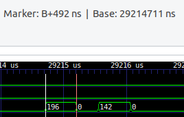

#tool

[GTKWave 3.3 Wave Analyzer User's Guide.pdf](zotero://open-pdf/library/items/8UFLX92N)

## gtkwave

Ctrl+T打开新的tab，选择vcd波形文件。

### marker量时间

https://stackoverflow.com/questions/47586756/how-do-i-measure-time-between-two-markers-in-gtkwave

鼠标中键点击（快捷键B），会出现白色线，这个作为起点；然后，鼠标左键点击终点，上面会计算时间，B+/-的形式。

