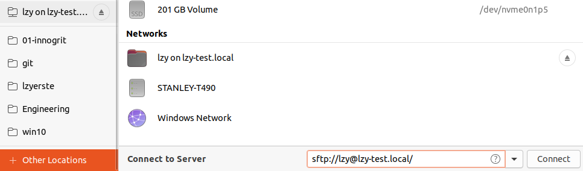

#git

https://www.sublimemerge.com/

## 打开远程仓库

https://github.com/sublimehq/sublime_merge/issues/325#issuecomment-458736640

https://askubuntu.com/questions/157507/opening-the-file-browser-of-the-remote-machine-via-terminal-and-moving-files-aro

比如从开发机上打开测试机上的仓库。因为测试机性能强，使用vscode远程编程。

使用sftp。

先使用本地文件浏览器nautilus添加网络地址（相当于mount到本地），然后使用sublime merge正常打开。

也可以命令行添加：

```sh
nautilus sftp://lzy@test
```

> 但是sftp过段时间会失去连接？



## 文件历史

```sh
file: "ftl/frb_log.c"
```

## 行历史

```sh
file: "src/osd/OSD.cc" line:150-170
```