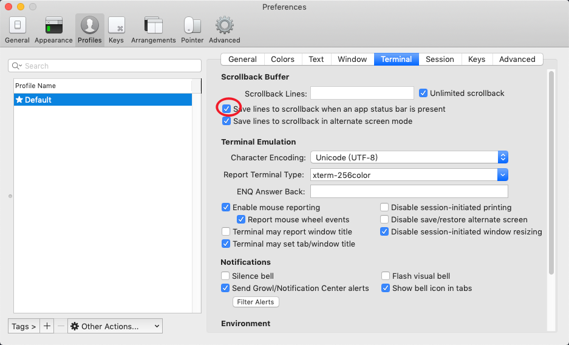

# mac iterm2 tmux鼠标不起作用

[iterm + tmux isn't allowing me to scroll up with the mouse](https://apple.stackexchange.com/questions/218553/iterm-tmux-isnt-allowing-me-to-scroll-up-with-the-mouse)

> In iTerm2 all you need to do is to go to Preferences > Profile > Terminal and check ‘Save lines to scrollback when an app status bar is present’.
> 

