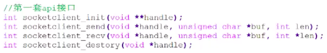
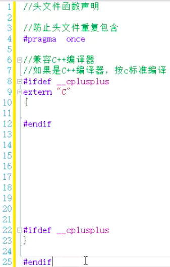
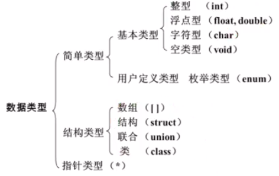
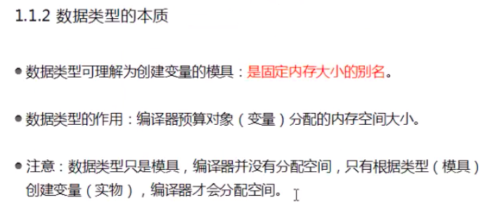
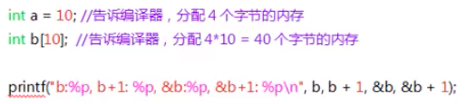
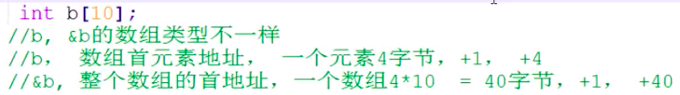

# C语言提高、进阶视频（B站）

- B站视频（黑马程序员）：
    
    
    

## Day 01

- 课程内容：

笔记：

- 接口的封装与设计（API）
- 内存布局

- 数据类型
    
    
    
- 数据类型本质
    
    
    
    sizeof
    

b指向数组首元素地址，&b指向整个数组起始地址

- typedef
- void类型
    - 参数为空，可以在参数声明里写void
    - 返回值为void
    - void指针，指针所需空间是确定一致的
    - 没有void普通变量