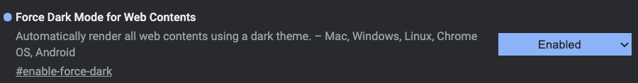

#google 

# Chrome [wiki]

2021-01-11: Yes
坚果云: Yes

登录谷歌账户，同步插件及配置。

# 问题

- [ ] Ubuntu下不能打开本地 #markdown 文件，会变成直接下载。Firefox设置后是可以的。

# 设置

## 深色模式

主题：James White

强制深色：没太大必要

- chrome://flags

# 插件

## Dark Reader

深色主题化

## iGuge

科学上网，付费购买账号。

## Notion Boost

https://chrome.google.com/webstore/detail/notion-boost/eciepnnimnjaojlkcpdpcgbfkpcagahd/

[notion](bash/notion.md)

很多小功能，比如目录在边栏一直显示、默认显示宽屏。

## Vimium

vim的方式操作浏览器。

自定义样式（配合深色主题）：[https://github.com/dracula/vimium](https://github.com/dracula/vimium)

常用按键：TODO

[vimium-darcula.css](../personal/ubuntu重装系统/Ubuntu重装清单/chrome/vimium-darcula%20css%20b477ed5bacb34e0aa3adb6b5a7b1cecd.md)

## ❌ 安装旧版本（新版本已修复）

新版本92有个bug，输入法的回退键会直接把底下的字给删了。

回退到90版本就正常了。

[https://www.slimjet.com/chrome/google-chrome-old-version.php](https://www.slimjet.com/chrome/google-chrome-old-version.php)

[https://www.tutsandtips.com/chrome/where-to-download-old-versions-of-google-chrome/](https://www.tutsandtips.com/chrome/where-to-download-old-versions-of-google-chrome/)