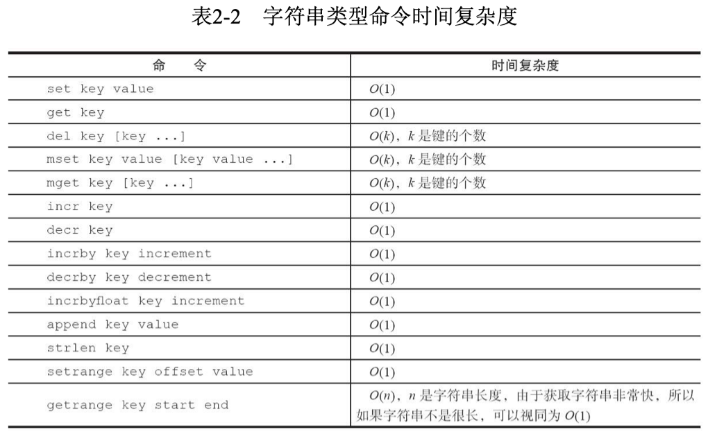
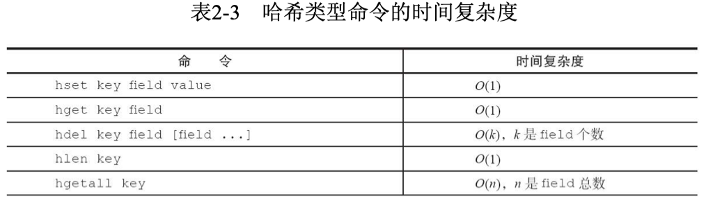
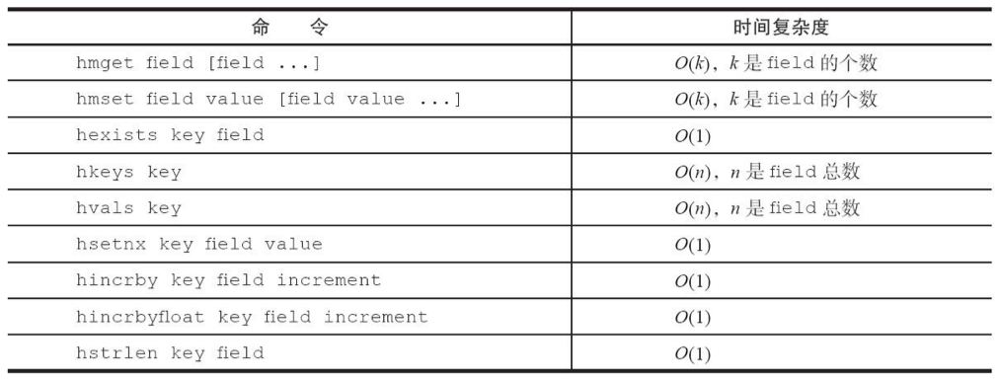
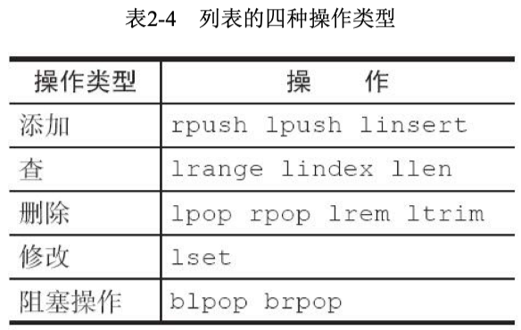
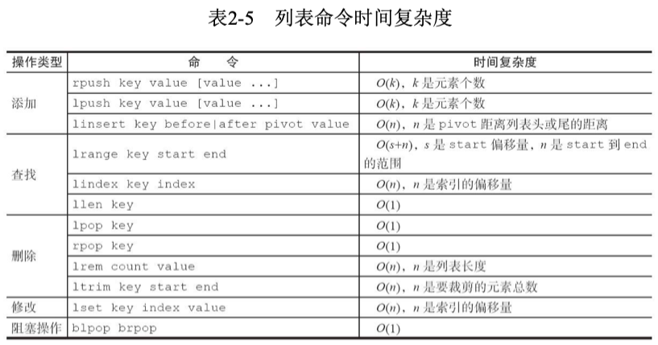
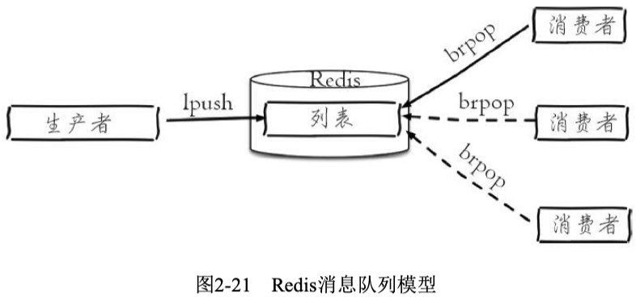
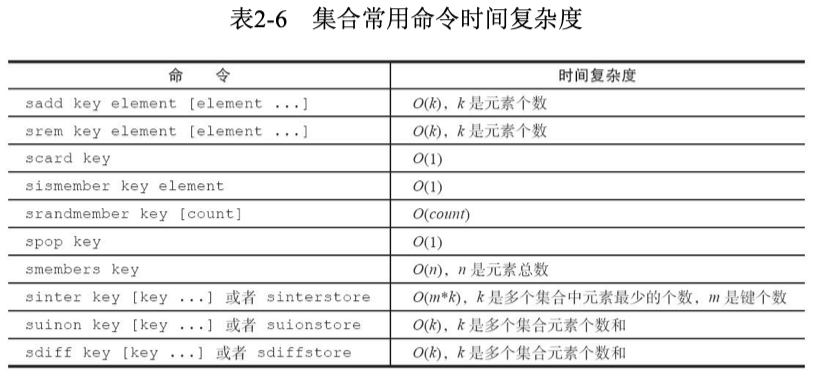
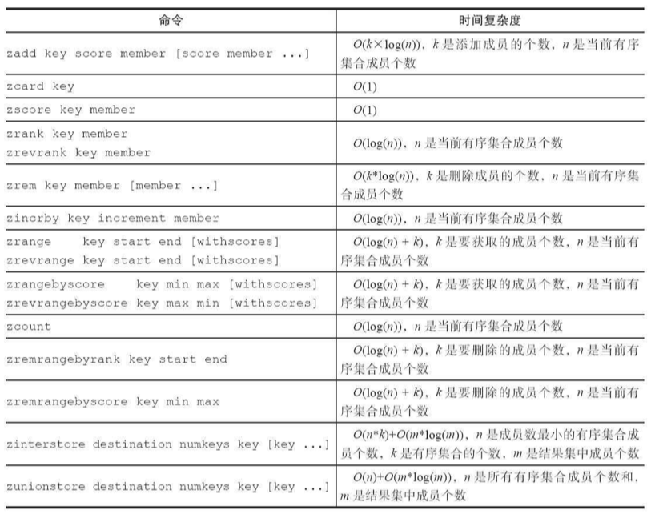

# 第2章：API的理解和使用

## 2.2 字符串

- setnx可以作为分布式锁的一种实现方案，因为只有一个客户端会设置成功。
    
    [Distributed locks with Redis - Redis](http://redis.io/topics/distlock)
    
- `string`内部编码
    - **int**：8个字节的长整型。
    - **embstr**：小于等于39个字节的字符串。
    - **raw**：大于39个字节的字符串

## 2.3 哈希

- `hash`内部编码
    - ziplist（压缩列表），较小的时候，更加紧凑。field数量比较少（不超过512）且value较小（64字节）
    - hashtable（哈希表），读写时间复杂度为O(1)。
- 命令列表：

## 2.4 列表

- 存储多个有序字符串，可包含重复元素
- 一个列表最多可以存储2^32-1个元素
- 类似deque，可以两端插入（push）及弹出（pop），支持范围查询
- 它可以充当栈和队列的角色

- 阻塞式弹出（blpop，brpop）多说一下，可以同时监听多个列表，可以带有timeout。如果监听的列表有不为空的，那么就直接操作，弹出返回。如果列表为空，会一直等待，直到超时（timeout为0会无限等待）。如果其他客户端在此期间有插入操作，就会唤醒它。如果有多个客户端在等待，按照FIFO顺序执行。这是什么机制呢？

- 注意lindex和lset的复杂度，为O(N)，说明是linked list。
- 不支持检查某个元素是否在列表中。
- `list`内部编码
    - ziplist（压缩列表）
    - linkedlist（链表）
    - Redis3.2版本提供了quicklist内部编码，简单地说它是以一个ziplist为节点的linkedlist，它结合了ziplist和linkedlist两者的优势。
    
    [Redis Quicklist - From a More Civilized Age](https://matt.sh/redis-quicklist)
    
- 消息队列使用场景

## 2.5 集合

- set：无重复元素、无序
- 一个集合最多可以存储2^32-1个元素
- 支持集合内的增删改查
- 支持多个集合取交集、并集、差集

- set内部编码
    - intset（整数集合），元素类型为整数且较少的时候（512个）
    - hashtable（哈希表）
- 典型使用场景是标签（tag）
    - 用户和标签的关系维护应该在一个事务内执行

## 2.6 有序集合

- 无重复元素、元素间有序，每个元素对应一个分数（可以有重复），排序依据就是分数。

- ordered set内部编码
    - ziplist（压缩列表），元素较少时
    - skiplist（跳跃表），元素较多时
- 有序集合比较典型的使用场景就是排行榜系统。