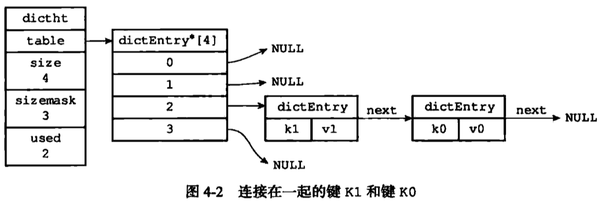
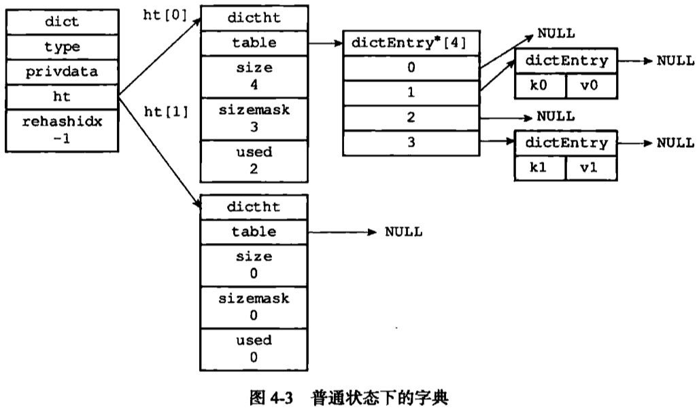

# 第4章：字典

- 文件：dict.h，哈希表的实现
    
    > * This file implements in-memory hash tables with insert/del/replace/find/
    * get-random-element operations. Hash tables will `auto-resize` if needed
    * tables of `power of two` in size are used, collisions are handled by
    * `chaining`. See the source code for more information... :)
    > 
- 

```c
typedef struct dictht {
    dictEntry **table;
    unsigned long size;
    unsigned long sizemask;
    unsigned long used;
} dictht;

typedef struct dict {
    dictType *type;
    void *privdata;
    dictht ht[2];
    long rehashidx; /* rehashing not in progress if rehashidx == -1 */
    int iterators; /* number of iterators currently running */
} dict;
```





- MurmurHash2算法：即使输入键是有规律的，仍能给出很好的随机分布性。计算速度也快。
- rehashing
    - 扩容时，2 * used的下一个2次幂
    - 收缩时，used的下一个2次幂
- 渐进式rehash
    - 新添加的键值放到新表
    -