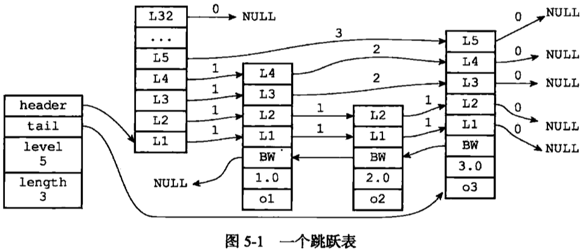

# 第5章：跳跃表

- lg(N)的查找时间，类似平衡树
- 论文：Skip Lists
- 文件：redis.h

```c
/* ZSETs use a specialized version of Skiplists */
typedef struct zskiplistNode {
    robj *obj;
    double score;
    struct zskiplistNode *backward;
    struct zskiplistLevel {
        struct zskiplistNode *forward;
        unsigned int span;
    } level[];
} zskiplistNode;

typedef struct zskiplist {
    struct zskiplistNode *header, *tail;
    unsigned long length;
    int level;
} zskiplist;

typedef struct zset {
    dict *dict;
    zskiplist *zsl;
} zset;
```



[深入剖析 redis 数据结构 skiplist - 捣乱小子](http://daoluan.net/%E6%9C%AA%E5%88%86%E7%B1%BB/2014/06/26/decode-redis-data-struct-skiplist.html)