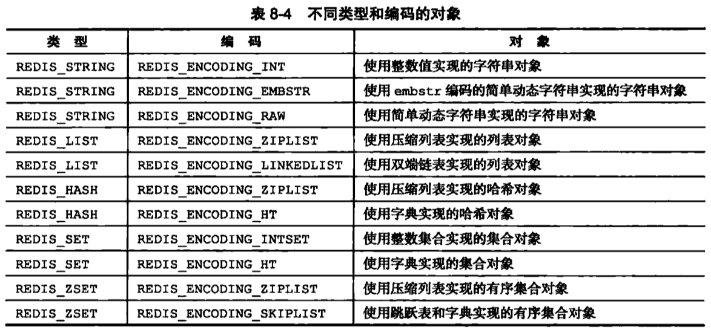
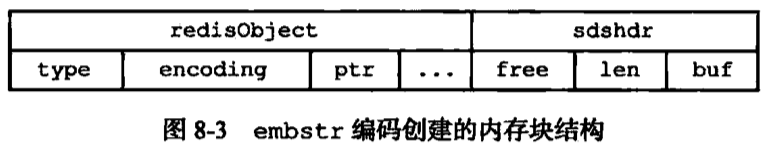

# 第8章：对象

- 基于前面的基础数据结构封装成对象
- 文件：redis.h

```c
typedef struct redisObject {
    unsigned type:4;
    unsigned encoding:4;
    unsigned lru:REDIS_LRU_BITS; /* lru time (relative to server.lruclock) */
    int refcount;
    void *ptr;
} robj;
```

```c
/* Object types */
#define REDIS_STRING 0
#define REDIS_LIST 1
#define REDIS_SET 2
#define REDIS_ZSET 3
#define REDIS_HASH 4
```



- 一种类型对应多种编码，适应不同使用场景。



- embstr相当于是只读的，要修改需要先升级为raw
- 

```c
/* Db->dict, keys are sds strings, vals are Redis objects. */
dictType dbDictType = {
    dictSdsHash,                /* hash function */
    NULL,                       /* key dup */
    NULL,                       /* val dup */
    dictSdsKeyCompare,          /* key compare */
    dictSdsDestructor,          /* key destructor */
    dictRedisObjectDestructor   /* val destructor */
};
```