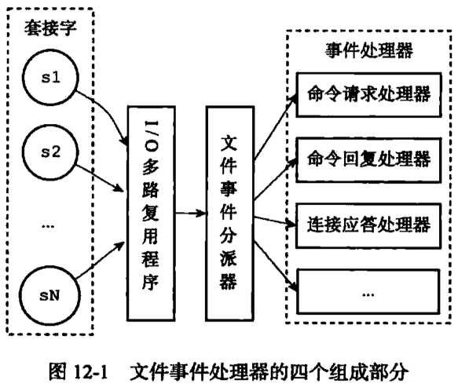
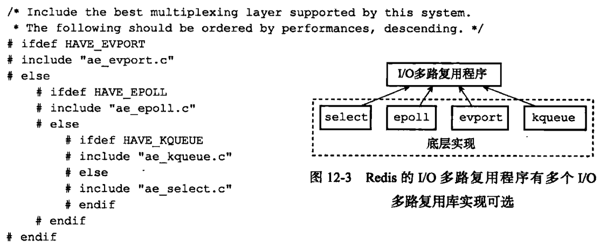
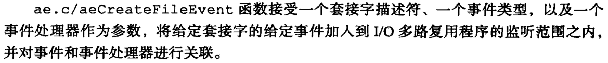
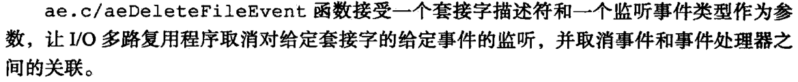
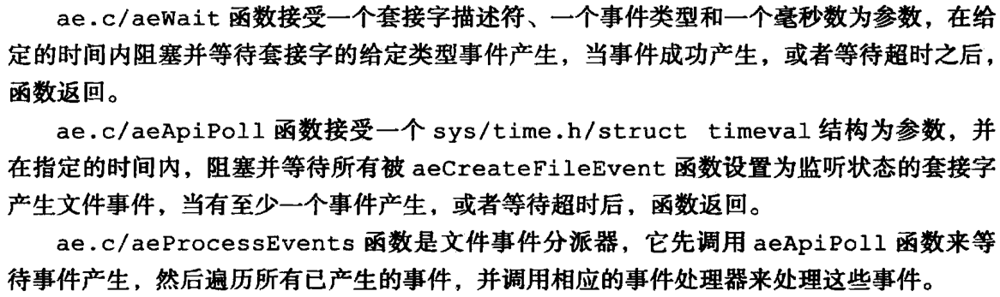

# 事件处理

- Redis服务器基于事件处理机制，是个事件驱动程序（单进程）
    - 文件事件
        - 客户端产生的事件，通过socket连接，抽象成文件
        - 使用IO多路复用机制来同时监听多个socket
    - 时间事件
        - 服务器自身的一些定时任务，如serverCron
    - 基于Reactor模式



- IO多路复用，底层可以有多种实现
    - select
    - epoll
    - evport
    - kqueue
    - 优先顺序是evport > epoll > kqueue > select
    
    
    
- 事件类型
    - 可读，AE_READABLE，服务器可以从socket读内容
    - 可写，AE_WRITABE，服务器可以向socket写内容
    - 如果同时可读可写，可读优先
- API
    
    
    
    
    
    
    

---

- select IO多路复用
    - ae_select.c
    - ae_epoll.c
    - ae_kqueue.c，MacOS
    - ae_evport.c，Solaris

```c
redis.c/main()
	srand(time(NULL)^getpid());  // 随机数种子
	initServerConfig();  // 先默认初始化，后面根据命令行参数再更新
	sentinel_mode处理
	
	处理命令行参数

	if (server.daemonize) daemonize();  // 是否守护进程
	initServer();
		// 建立常用的共享object，比如常用数字
		createSharedObjects();
		// 建立EventLoop
    server.el = aeCreateEventLoop(server.maxclients+REDIS_EVENTLOOP_FDSET_INCR);
		// 建立空的DB
    server.db = zmalloc(sizeof(redisDb)*server.dbnum);
		// 建立监听socket
		listenToPort(server.port,server.ipfd,&server.ipfd_count)
		// 时间事件（serverCron，周期性任务）
		aeCreateTimeEvent(server.el, 1, serverCron, NULL, NULL)
		// 监听客户端连接事件（READABLE）
		aeCreateFileEvent(server.el, server.ipfd[j], AE_READABLE, acceptTcpHandler,NULL)

	aeMain(server.el);
	aeDeleteEventLoop(server.el);
```

---

```c
createSharedObjects()
	// 0到10000的整数
	for (j = 0; j < REDIS_SHARED_INTEGERS; j++) {
    shared.integers[j] = createObject(REDIS_STRING,(void*)(long)j);
    shared.integers[j]->encoding = REDIS_ENCODING_INT;
  }
```

---

ae.c/aeMain

```c
void aeMain(aeEventLoop *eventLoop) {
    eventLoop->stop = 0;
    while (!eventLoop->stop) {
        if (eventLoop->beforesleep != NULL)
            eventLoop->beforesleep(eventLoop);
        aeProcessEvents(eventLoop, AE_ALL_EVENTS);
    }
}
```

```c
int aeProcessEvents(aeEventLoop *eventLoop, int flags)
	shortest = aeSearchNearestTimer(eventLoop);  // 最近的时间事件
	numevents = aeApiPoll(eventLoop, tvp);  // 监听File事件
	fe->rfileProc(eventLoop,fd,fe->clientData,mask);  // 处理READABLE
	fe->wfileProc(eventLoop,fd,fe->clientData,mask);  // 处理WRITABLE
	processed += processTimeEvents(eventLoop);  // 处理Time事件
```

- File事件处理函数主要有：
    - acceptTcpHandler，READABLE，建立与客户端的连接
    - readQueryFromClient，READABLE，读取客户端的查询命令
    - sendReplyToClient，WRITABLE，向客户端发送结果