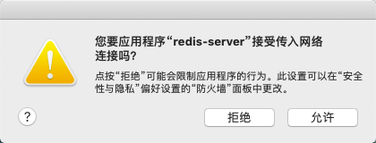
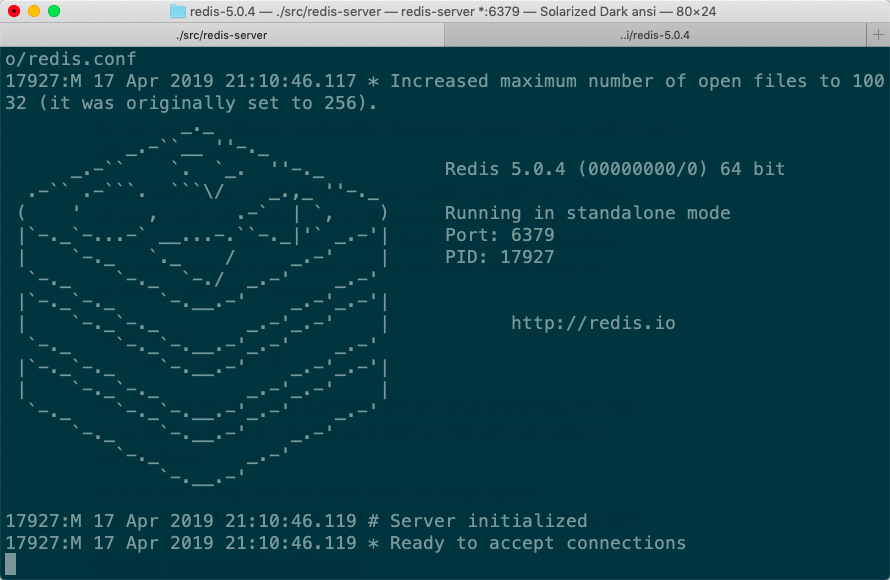
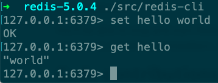

# Redis Tutorial for Beginners

[Redis Tutorial for Beginners - YouTube](https://www.youtube.com/playlist?list=PLS1QulWo1RIYZZxQdap7Sd0ARKFI-XVsd)

- `安装`
    - 下载源码包
    - 在根目录make，生成的可执行文件在src目录下。
    - 如果make install，可执行文件会复制一份到/usr/local/bin下面。
    - make test做测试，耗时较长。
    
    [Redis](https://redis.io/download)
    
- `启动server`
    - ./src/redis-server
    - 弹框提示是否允许网络连接
        
        
        
    - 默认端口号是6379
        
        
        
- `启动client`
    - ./src/redis-cli
        
        
        
    - 输入命令的时候会有实时提示命令格式