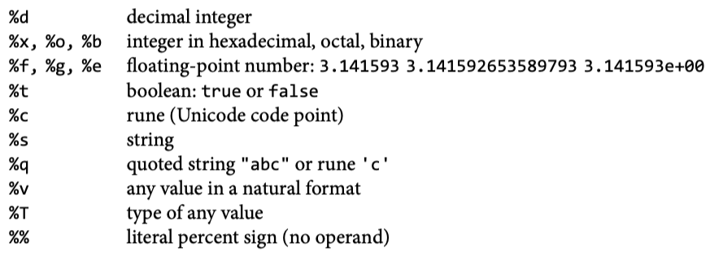

# Go语言概述

## 变量类型

- Note, however, that `short variable declarations` can only be used inside of functions/methods (declaring global variables at the package level can only be done using a regular variable declaration: var name type = value).

### const常量

```go
const (
	whiteIndex = 0 // first color in palette
	blackIndex = 1 // next color in palette
)
```

### composite literals

针对slice：

```go
var palette = []color.Color{color.White, color.Black}
```

针对struct：

```go
anim := gif.GIF{LoopCount: nframes}
```

## if判断

```go
if len(files) == 0 {
	fmt.Println("length is 0")
} else {
	fmt.Println("length > 0")
}
```

## for循环

continue, break关键字照常。

---

标准for循环（三段式）：

```go
for i := 1; i < len(os.Args); i++ {
		s += sep + os.Args[i]
		sep = " "
	}
```

类似while：

```go
for input.Scan() {
		counts[input.Text()]++
	}
```

range遍历列表（index, value）：

```go
for _, arg := range os.Args[1:] {
		s += sep + arg
		sep = " "
	}
```

range遍历map（key, value）：

```go
for line, n := range counts {
		if n > 1 {
			fmt.Printf("%d\t%s\n", n, line)
		}
	}
```

## switch

case后面不需要break。

```go
switch coinflip() {
case "heads":
	heads++
case "tails":
	tails++
default:
	fmt.Println("landed on edge!")
}
```

```go
func Signum(x int) int {
	// 相当于switch true {
	switch {
	case x > 0:
		return +1
	default:
		return 0
	case x < 0:
		return -1
	}
}
```

## 函数

- Functions and other package-level entities may be declare d in any order.

## 字符串

## 列表

## 字典

- `counts := make(map[string]int)`
    - 这里`make`函数创建一个字典实体，key类型为string，value类型为int。
    - 新添加一项，如果key不存在，会自动`默认初始化`。
    - for k, v := `range` counts
    - `unordered` map
    - A map is a `reference` to the data structure create d by make.

## 并行

- goroutine
- channel

```go
ch := make(chan string)  // 创建channel
go fetch(url, ch)  // 异步执行goroutine
fmt.Println(<-ch) // receive from channel ch
ch <- fmt.Sprintf("%.2fs %7d %s", secs, nbytes, url)
```

- When one goroutine attempts a send or receive on a channel, it `blocks` until another goroutine attempts the corresponding receive or send operation.
- 共享变量，sync.Mutex

## 输入输出

### fmt

- fmt.Println()
- fmt.Printf()
    
    
    

## os

- `os.Args`，命令行参数（string slice），第0个参数是命令本身
- os.Stdin, os.Stdout, os.Stderr，标准输入输出

### bufio

- `input := bufio.NewScanner(os.Stdin)`
    - 读入输入并分割成行（包不包含换行符？不包含）
- `input.Scan()`
    - 读取一行，换行符会去除，读到的内容通过input.Text()得到，Scan()本身返回值是boolean，如果能读到内容，就返回true，读不到了就返回false

## io/ioutil

- ioutil.ReadFile()，一次性读取整个文件。

## 文件操作

- os.Open()，返回类型为*os.File。

## 图像操作

### image