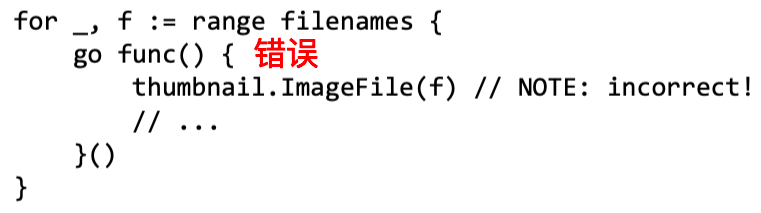
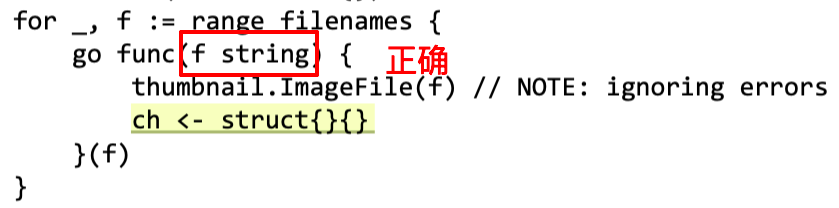

# go中的坑

- slice扩展后可能会丢失原来的引用，最好将slice作为返回值。
- for循环作用域（匿名函数），遍历项是指向同一个引用。
    
    
    
    Above, the single variable f is share d by all the anonymous function values and updated by successive loop iterations.
    
    要使用explicit parameter
    
    
    
- goroutine有时候需要类似barrier的操作，等待所有其他goroutine完成后，main routine才退出。