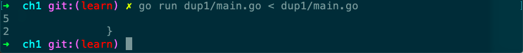

# dup1

Desc: Dup1 prints the text of each line that appears more than once in the standard input, preceded by its count.
Source: gopl.io/ch1/dup1
备注: map, bufio
章节: 1.3



5个空行

```go
// Dup1 prints the text of each line that appears more than
// once in the standard input, preceded by its count.
package main

import (
	"bufio"
	"fmt"
	"os"
)

func main() {
	counts := make(map[string]int)
	input := bufio.NewScanner(os.Stdin)
	for input.Scan() {
		counts[input.Text()]++
	}
	// NOTE: ignoring potential errors from input.Err()
	for line, n := range counts {
		if n > 1 {
			fmt.Printf("%d\t%s\n", n, line)
		}
	}
}
```