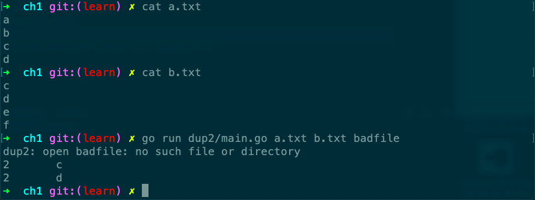

# dup2

Desc: Dup2 prints the count and text of lines that appear more than once in the input.  It reads from stdin or from a list of named files.
Source: gopl.io/ch1/dup2
备注: os.Open(), os.Fille
章节: 1.3



```go
// Dup2 prints the count and text of lines that appear more than once
// in the input.  It reads from stdin or from a list of named files.
package main

import (
	"bufio"
	"fmt"
	"os"
)

func main() {
	counts := make(map[string]int)
	files := os.Args[1:]
	if len(files) == 0 {
		countLines(os.Stdin, counts)
	} else {
		for _, arg := range files {
			f, err := os.Open(arg)
			if err != nil {
				fmt.Fprintf(os.Stderr, "dup2: %v\n", err)
				continue
			}
			countLines(f, counts)
			f.Close()
		}
	}
	for line, n := range counts {
		if n > 1 {
			fmt.Printf("%d\t%s\n", n, line)
		}
	}
}

func countLines(f *os.File, counts map[string]int) {
	input := bufio.NewScanner(f)
	for input.Scan() {
		counts[input.Text()]++
	}
	// NOTE: ignoring potential errors from input.Err()
}
```