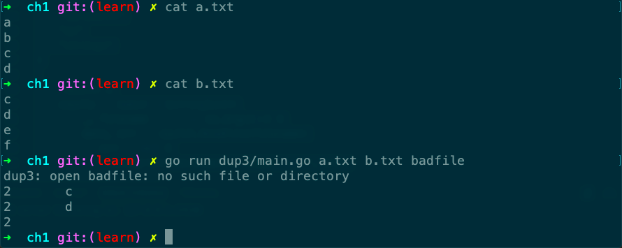

# dup3

Desc: Dup3 prints the count and text of lines that appear more than once in the named input files.
Source: gopl.io/ch1/dup3
备注: io/ioutil, ioutil.ReadFile()
strings.Split()
章节: 1.3

跟dup2比，多了2个空字符串，这是strings.Split()带来的。



```go
// Copyright © 2016 Alan A. A. Donovan & Brian W. Kernighan.
// License: https://creativecommons.org/licenses/by-nc-sa/4.0/

// See page 12.

//!+

// Dup3 prints the count and text of lines that
// appear more than once in the named input files.
package main

import (
	"fmt"
	"io/ioutil"
	"os"
	"strings"
)

func main() {
	counts := make(map[string]int)
	for _, filename := range os.Args[1:] {
		data, err := ioutil.ReadFile(filename)
		if err != nil {
			fmt.Fprintf(os.Stderr, "dup3: %v\n", err)
			continue
		}
		for _, line := range strings.Split(string(data), "\n") {
			counts[line]++
		}
	}
	for line, n := range counts {
		if n > 1 {
			fmt.Printf("%d\t%s\n", n, line)
		}
	}
}

//!-
```