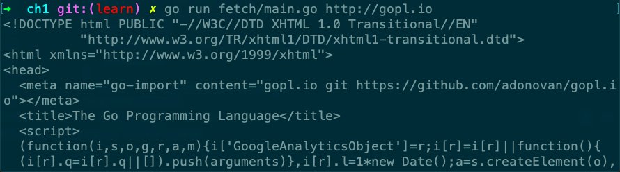
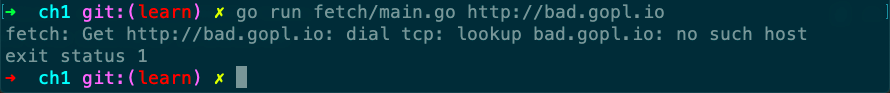

# fetch

Desc: Fetch prints the content found at each specified URL.
Source: gopl.io/ch1/fetch
备注: net/http
章节: 1.5



获取正常url



异常url

```go
// Copyright © 2016 Alan A. A. Donovan & Brian W. Kernighan.
// License: https://creativecommons.org/licenses/by-nc-sa/4.0/

// See page 16.
//!+

// Fetch prints the content found at each specified URL.
package main

import (
	"fmt"
	"io/ioutil"
	"net/http"
	"os"
)

func main() {
	for _, url := range os.Args[1:] {
		resp, err := http.Get(url)
		if err != nil {
			fmt.Fprintf(os.Stderr, "fetch: %v\n", err)
			os.Exit(1)
		}
		b, err := ioutil.ReadAll(resp.Body)
		resp.Body.Close()
		if err != nil {
			fmt.Fprintf(os.Stderr, "fetch: reading %s: %v\n", url, err)
			os.Exit(1)
		}
		fmt.Printf("%s", b)
	}
}

//!-
```