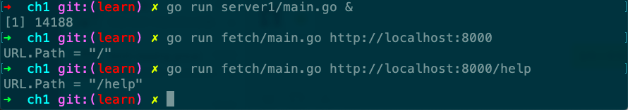
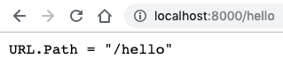

# server1

Desc: Server1 is a minimal "echo" server.
Source: gopl.io/ch1/server1
备注: net/http
章节: 1.7





```go
// Copyright © 2016 Alan A. A. Donovan & Brian W. Kernighan.
// License: https://creativecommons.org/licenses/by-nc-sa/4.0/

// See page 19.
//!+

// Server1 is a minimal "echo" server.
package main

import (
	"fmt"
	"log"
	"net/http"
)

func main() {
	http.HandleFunc("/", handler) // each request calls handler
	log.Fatal(http.ListenAndServe("localhost:8000", nil))
}

// handler echoes the Path component of the requested URL.
func handler(w http.ResponseWriter, r *http.Request) {
	fmt.Fprintf(w, "URL.Path = %q\n", r.URL.Path)
}

//!-
```