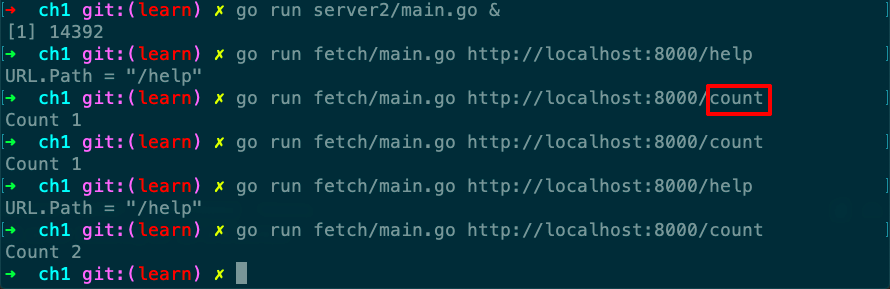

# server2

Desc: Server2 is a minimal "echo" and counter server.
Source: gopl.io/ch1/server2
备注: sync.Mutex
章节: 1.7



```go
// Copyright © 2016 Alan A. A. Donovan & Brian W. Kernighan.
// License: https://creativecommons.org/licenses/by-nc-sa/4.0/

// See page 20.
//!+

// Server2 is a minimal "echo" and counter server.
package main

import (
	"fmt"
	"log"
	"net/http"
	"sync"
)

var mu sync.Mutex
var count int

func main() {
	http.HandleFunc("/", handler)
	http.HandleFunc("/count", counter)
	log.Fatal(http.ListenAndServe("localhost:8000", nil))
}

// handler echoes the Path component of the requested URL.
func handler(w http.ResponseWriter, r *http.Request) {
	mu.Lock()
	count++
	mu.Unlock()
	fmt.Fprintf(w, "URL.Path = %q\n", r.URL.Path)
}

// counter echoes the number of calls so far.
func counter(w http.ResponseWriter, r *http.Request) {
	mu.Lock()
	fmt.Fprintf(w, "Count %d\n", count)
	mu.Unlock()
}

//!-
```