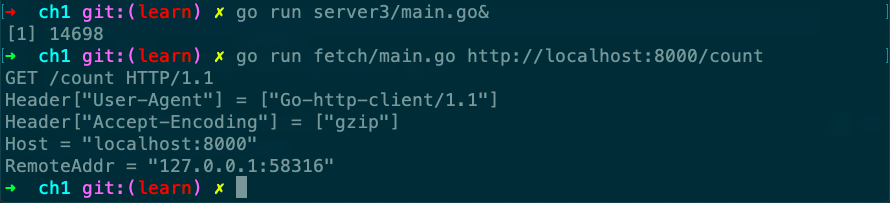

# server3

Desc: Server3 is an "echo" server that displays request parameters.
Source: gopl.io/ch1/server3
章节: 1.7



```go
// Copyright © 2016 Alan A. A. Donovan & Brian W. Kernighan.
// License: https://creativecommons.org/licenses/by-nc-sa/4.0/

// See page 21.

// Server3 is an "echo" server that displays request parameters.
package main

import (
	"fmt"
	"log"
	"net/http"
)

func main() {
	http.HandleFunc("/", handler)
	log.Fatal(http.ListenAndServe("localhost:8000", nil))
}

//!+handler
// handler echoes the HTTP request.
func handler(w http.ResponseWriter, r *http.Request) {
	fmt.Fprintf(w, "%s %s %s\n", r.Method, r.URL, r.Proto)
	for k, v := range r.Header {
		fmt.Fprintf(w, "Header[%q] = %q\n", k, v)
	}
	fmt.Fprintf(w, "Host = %q\n", r.Host)
	fmt.Fprintf(w, "RemoteAddr = %q\n", r.RemoteAddr)
	if err := r.ParseForm(); err != nil {
		log.Print(err)
	}
	for k, v := range r.Form {
		fmt.Fprintf(w, "Form[%q] = %q\n", k, v)
	}
}

//!-handler
```