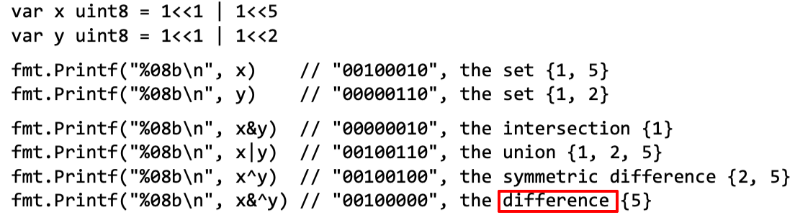
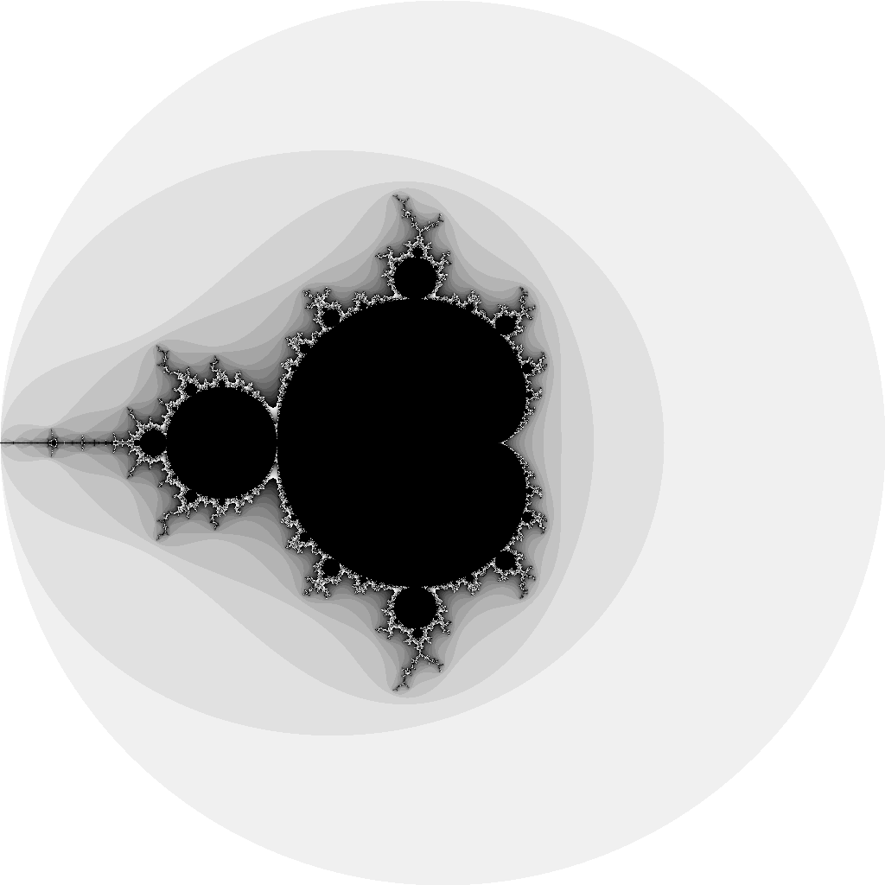

# Chapter 3: Basic Data Types

- 四种类型
    - basic types
    - aggregate types
    - reference types
    - interface types
- 这章讲基本类型：numbers, strings, and booleans

## 3.1 Integers

- signed：int8, int16, int32, and int64
- unsigned：uint8, uint16, uint32, and uint64
- int和uint，大小可能是32或者64位
    - 即使int底层是32位，也不能跟int32混为一谈，它们的类型是不一样的，需要显式类型转换。
- rune：int32，Unicode code point
- byte：uint8
- uintptr
- 求余%
    - remainder operator % applies only to integers
    - In Go, the sign of the remainder is always the same as the sign of the `dividend`, so -5%3 and -5%-3 are both -2.
- 除法/与C语言类似，整型除法结果向零靠拢
- In fact, all values of basic type—booleans, numbers, and strings—are comparable
- &^：bit clear (AND NOT)，z = x &^ y，如果y上的对应位为1，则z对应位为0；否则如果y上的对应位为0，则z对应位保持x对应位。相当于将y视为mask，对x进行清理。相当于z = x & (^y)。
- ^有两个作用：如果作为二目运算符，则是异或操作；如果是单目运算，则作为NOT操作。

## 3.2 Floating-Point Numbers

- Figure 3.1：go run surface/main.go > surface.svg

## 3.3 Complex Numbers

- Figure 3.3：go run mandelbrot/main.go > mandelbrot.png

## 3.4 Booleans

- bool: true and false
- bool跟整数不能直接转换

## 3.5 Strings