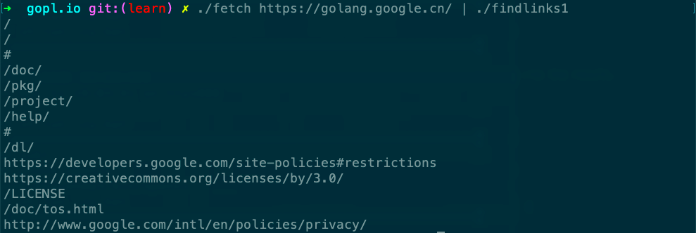

# Chapter 5: Functions

- findlinks1
    - 依赖golang.org/x/net/html包
    - 从github下载源码到golang.org/x目录下（[https://github.com/golang/net](https://github.com/golang/net)）
    - go build [gopl.io/ch1/fetch](http://gopl.io/ch1/fetch)
    - go build [gopl.io/ch5/findlinks1](http://gopl.io/ch5/findlinks1)
    - ./fetch [https://golang.google.cn/](https://golang.google.cn/) | ./findlinks1
        
        
        
    -