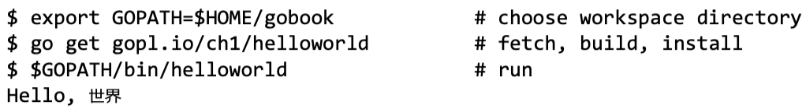
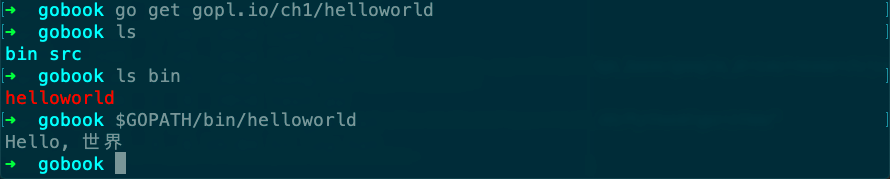

# Preface

- communicating sequential processes (CSP) from Tony Hoare’s seminal 1978 paper on the foundations of concurrency
- no class hierarchies
- All but the most trivial code examples in the book are available for download from the public Git repository at [gopl.io](http://gopl.io/).
- 环境：

