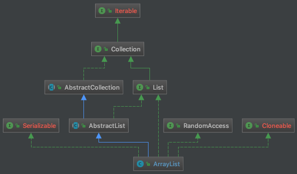

# ArrayList

## Keywords

- 非线程安全（可在外面套一层`Collections.synchronizedList`）
- `add`操作平摊下是O(1)复杂度
- 底部是一个数组，有一个容量`capacity`。容量的变化策略是什么呢？

## 关键字段

- Object[] **`elementData`**
    
    > 它的长度就是capacity了
    > 
- int **`size`**

---

- int `DEFAULT_CAPACITY` = 10
- Object[] `EMPTY_ELEMENTDATA` = {}
    
    > 显式指定为空的时候，用这个。比如初始化时传入参数size为0。
    > 
- Object[] `DEFAULTCAPACITY_EMPTY_ELEMENTDATA` = {}
    
    > 默认初始化（如不传入参数），则使用该项。add的时候，就自动扩展到DEFAUTL_CAPACITY。
    > 

## 关键方法

- `capacity`如何调整？
    
    > grow的时候，一般是增长当前容量的50%，传入的参数minCapacity是下限。
    那么，capacity什么时候减小呢？并没有减小一说。
    > 
-