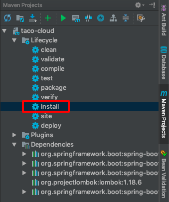

# 第2章

- IDEA要安装lombok插件，要不然IDE显示错误（实际并无错误）。
    
    
    

---

- 基本MVC流程
- 验证用户输入
- @ModelAttribute注解

[Difference Between @NotNull, @NotEmpty, and @NotBlank Constraints in Bean Validation | Baeldung](https://www.baeldung.com/java-bean-validation-not-null-empty-blank)

- 生成独立的jar包
    - 使用maven的install来生成，目标文件在target目录
    
    