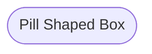

---
tags:
- markdown
title: mermaid
---

## Directions

```
graph TD  # top down
graph TB  # top to bottom
graph BT  # bottom to top
graph LR  # left to right
graph RL  # right to left
```

## Shapes





## Links


## Flow Chart

https://mermaid-js.github.io/mermaid/#/flowchart


## Class Diagram


## State Diagram


## Pie Chart

