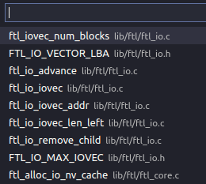

# gtags

Tags: gtags

- 安装
    
    ```cpp
    sudo apt install global
    ```
    
- 在项目根目录放置gtags.conf，以跳过一些目录的索引。
    
    [gtags.conf](assets/gtags.conf)
    
    ```cpp
    common:\
    	:skip=GPATH,GTAGS,GRTAGS,GSYMS,HTML/,HTML.pub/,html/,tags,TAGS,ID,y.tab.c,y.tab.h,cscope.out,cscope.po.out,cscope.in.out,SCCS/,RCS/,CVS/,CVSROOT/,{arch}/,autom4te.cache/,**dpdk/,build/,test/**:
    ```
    
    另一种方式是文件~/.globalrc，但这个是全局的。
    
- 生成gtags索引
    
    ```cpp
    gtags -iv
    ```
    
    -i表示增量式生成。
    
- 搭配vscode插件`Fuzzy Tag For C/C++`，F10快捷键来模糊关键字查询。
    
    比如关键字`ftl iov`
    
    