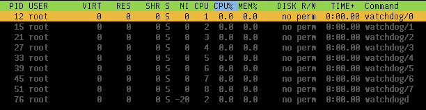

# IT log book: Linux - what are "CPU lockups”? - News, tips & guidance for agile, development, Atlassian-Software (JIRA, Confluence, Bitbucket, ...) and Google Cloud

[https://blog.seibert-media.com/2018/01/04/log-book-linux-cpu-lockups/](https://blog.seibert-media.com/2018/01/04/log-book-linux-cpu-lockups/)

## **Short answer**

> A ‘soft lockup’ is defined as a bug that causes the kernel to loop in kernel mode for more than 20 seconds […], without giving other tasks a chance to run. A ‘hard lockup’ is defined as a bug that causes the CPU to loop in kernel mode for more than 10 seconds […], without letting other interrupts have a chance to run.
> 

In other words, during a **soft lockup** a kernel task won't unlock the CPU, like in the good old DOS days. So "something or other” is left "hanging”. During a **hard lockup** interrupts aren’t even being processed, which more clearly points to a bug: something is masking interrupts and not unlocking.

## **Is that bad? Has the system crashed?**

### **Generally**

We can configure whether a detected lockup will trigger a panic:

```
$ sysctl kernel.softlockup_panic kernel.hardlockup_panic
kernel.softlockup_panic = 0
kernel.hardlockup_panic = 0

```

But in Ubuntu this appears to be deactivated by default. So initially, the system keeps running and can theoretically right itself again.

With XenServer, it’s a different story:

```
$ cat /proc/sys/kernel/softlockup_panic
1

```

There is no hard lockup watchdog here. This explains why a XenServer host freezes as soon as a soft lockup occurs:

```
[41819967.871466]  EMERG: BUG: soft lockup - CPU#3 stuck for 23s! [tapdisk:23395]
[41819967.872648]  EMERG: Kernel panic - not syncing: softlockup: hung tasks

```

### **Soft lockups**

With a soft lockup, all you know is that somewhere a kernel task is running and not unlocking a core. Maybe it will keep running. Maybe it won’t.

An allegedly typical scenario is this:

- Task 1 locks a resource by way of a spinlock.
- Task 2 also wants to have the spinlock.
- Task 1 doesn’t unlock it for a rather long time.

Being a spinlock, task 2 is waiting "actively”, checking over and over again whether it can have its turn yet. This can lead to a soft lockup message. We should be able to recognize this by the RIP in the debug message on the console which is pointing to some function with acquire_spinlock in its name.

### **Hard lockups**

I haven't yet been able to find any information on this. Once interrupts are no longer being processed, it's presumably quite a bad sign.

### **Causes**

Lockups can never be triggered by processes in the user space as the latter are always reliably scheduled and can be moved aside. If such a lockup occurs, then there has been a problem in the kernel.

The simplest cause is just bugs. We'll put that aside just now, because it's a boring cause, and we don't have much control over them.

From here you can probably assume: the kernel code expected that an action would be finished quickly, but that turned out to be wrong. So the kernel needs longer than it thought it would.

As described by Redhat, it could just be because of a very high system load. But at this point, you need to make a distinction: are you dealing with a "real” system or is it virtual? We have virtualized almost everything. Here VMware talks about [high levels of overcommitment](https://kb.vmware.com/s/article/1009996) as a possible cause, but it's not entirely clear to me in this context what this refers to – presumably the host.

It's in the nature of the beast that there is no universally valid answer. The watchdogs just detect that certain CPUs are still processing the one task and that the CPU is not being unlocked. That's all. With a bit of luck you can find out why from the stack traces displayed for the hung CPU.

## **What data can be gathered in the event of a lockup?**

When there is a lockup, there are several courses of action which can help with your analysis:

- If it is still possible to log in by SSH, gather screenshots from htop, dmesg and Syslog/Journal.
- If you can only see the console with the lockup messages, take screenshots of that.
    - Of interest are output of the process, the row with RIP and the stack trace.
    - Wait and see whether the output changes.
    - It's not certain that there's definitely *just the one* lockup – multiple CPUs could be affected. At this point, you can still hope that the CPU which originally caused the problem will eventually be reported.
    - If it’s something to do with Java, for example, chances are high that it’s just a consequential error.

## **Have a bit of a look around: Watchdogs**

Take note of the CPU affinity:



```
$ for pid in 12 15 21 27 33 39 45 51; do taskset -a -p $pid; done
pid 12's current affinity mask: 1       # Die Angaben sind hexadezimal.
pid 15's current affinity mask: 2
pid 21's current affinity mask: 4
pid 27's current affinity mask: 8
pid 33's current affinity mask: 10
pid 39's current affinity mask: 20
pid 45's current affinity mask: 40
pid 51's current affinity mask: 80

```

## **Provoke lockups with your own kernel module**

### **Soft lockups**

```
# apt install build-essential linux-headers-generic

```

**hog.c:**

```
#include <linux/init.h>
#include <linux/module.h>
#include <linux/kernel.h>
#include <linux/kthread.h>
 
MODULE_LICENSE("GPL");
 
static int
hog_thread(void *data)
{
    printk(KERN_INFO "Hogging a CPU now\n");
    while (1);
 
    /* unreached */
    return 0;
}
 
static int __init
hog_init(void)
{
    kthread_run(hog_thread, NULL, "hog");
    return 0;
}
 
module_init(hog_init);

```

**makefile:**

```
obj-m += hog.o
 
all:
    make -C /lib/modules/$(shell uname -r)/build/ M=$(PWD) modules
clean:
    make -C /lib/modules/$(shell uname -r)/build/ M=$(PWD) clean

```

```
root@ubuntu1604lts:~/thread# make
make -C /lib/modules/4.4.0-83-generic/build/ M=/root/thread modules
make[1]: Entering directory '/usr/src/linux-headers-4.4.0-83-generic'
  CC [M]  /root/thread/hog.o
  Building modules, stage 2.
  MODPOST 1 modules
  LD [M]  /root/thread/hog.ko
make[1]: Leaving directory '/usr/src/linux-headers-4.4.0-83-generic'
 
root@ubuntu1604lts:~/thread# insmod hog.ko

```

And wait. After about 20 seconds the message will appear in the first console and the stack trace will appear in dmesg:

```
[  355.900698] NMI watchdog: BUG: soft lockup - CPU#0 stuck for 22s! [hog:6885]
[  355.900735] Modules linked in: hog(OE) ppdev joydev input_leds parport_pc serio_raw parport i2c_piix4 8250_fintek mac_hid ib_iser rdma_cm iw_cm ib_cm ib_sa ib_mad ib_core ib_addr iscsi_tcp libiscsi_tcp libiscsi scsi_transport_iscsi autofs4 btrfs raid10 raid456 async_raid6_recov async_memcpy async_pq async_xor async_tx xor raid6_pq libcrc32c raid1 raid0 multipath linear hid_generic usbhid hid crct10dif_pclmul crc32_pclmul ghash_clmulni_intel aesni_intel aes_x86_64 lrw gf128mul glue_helper ablk_helper cryptd floppy pata_acpi psmouse
[  355.900761] CPU: 0 PID: 6885 Comm: hog Tainted: G           OEL  4.4.0-83-generic #106-Ubuntu
[  355.900762] Hardware name: QEMU Standard PC (i440FX + PIIX, 1996), BIOS 1.10.2-20170228_101828-anatol 04/01/2014
[  355.900764] task: ffff88007bef1c00 ti: ffff88007b7a8000 task.ti: ffff88007b7a8000
[  355.900765] RIP: 0010:[<ffffffffc0351015>]  [<ffffffffc0351015>] hog_thread+0x15/0x1000 [hog]
[  355.900769] RSP: 0018:ffff88007b7abeb8  EFLAGS: 00000286
[  355.900770] RAX: 0000000000000011 RBX: ffff88007b580500 RCX: 0000000000000006
[  355.900772] RDX: 0000000000000000 RSI: 0000000000000246 RDI: ffff88007fc0dd50
[  355.900773] RBP: ffff88007b7abeb8 R08: 000000000000000a R09: 000000000000022f
[  355.900774] R10: ffff880035596a00 R11: 000000000000022f R12: ffff88007bef1c00
[  355.900775] R13: 0000000000000000 R14: ffffffffc0351000 R15: 0000000000000000
[  355.900777] FS:  0000000000000000(0000) GS:ffff88007fc00000(0000) knlGS:0000000000000000
[  355.900778] CS:  0010 DS: 0000 ES: 0000 CR0: 0000000080050033
[  355.900779] CR2: ffffffffc0350fea CR3: 0000000001e0a000 CR4: 00000000001406f0
[  355.900783] Stack:
[  355.900784]  ffff88007b7abf48 ffffffff810a0c25 0000000000000000 0000000000000000
[  355.900786]  0000000000000000 ffff880000000000 ffff880000000000 ffff88007b7abef0
[  355.900789]  ffff88007b7abef0 ffffffff00000000 ffff880000000000 ffff88007b7abf10
[  355.900791] Call Trace:
[  355.900796]  [<ffffffff810a0c25>] kthread+0xe5/0x100
[  355.900799]  [<ffffffff810a0b40>] ? kthread_create_on_node+0x1e0/0x1e0
[  355.900802]  [<ffffffff81840f0f>] ret_from_fork+0x3f/0x70
[  355.900803]  [<ffffffff810a0b40>] ? kthread_create_on_node+0x1e0/0x1e0
[  355.900804] Code: <eb> fe 00 00 00 00 00 00 00 00 00 00 00 00 00 00 00 00 00 00 00 00

```

In this example, you can see quite nicely that my hog_thread has been identified as the culprit.

Here, we need note the following:

- If the system has more than one CPU, it's still usable.
- If you start enough kernel threads to fill all the CPUs to capacity, almost nothing will work. The messages about the soft lockup continue to appear on the console, but you no longer have a hope with SSH.

### **Hard lockups**

Here you need a slight variation of the above code:

```
#include <linux/init.h>
#include <linux/module.h>
#include <linux/kernel.h>
#include <linux/kthread.h>
#include <linux/spinlock.h>
 
MODULE_LICENSE("GPL");
 
static int
hog_thread(void *data)
{
    static DEFINE_SPINLOCK(lock);
    unsigned long flags;
 
    printk(KERN_INFO "Hogging a CPU now\n");
    spin_lock_irqsave(&lock, flags);
    while (1);
 
    /* unreached */
    return 0;
}
 
static int __init
hog_init(void)
{
    kthread_run(hog_thread, NULL, "hog");
    return 0;
}
 
module_init(hog_init);

```

It’s compiled and used in the exactly same way.

What do we see? As soon as the module is loaded, nothing works any more. This seems conclusive as, in the case of masked interrupts, (at least to my knowledge) the scheduler can no longer function either.

After a few seconds, you'll see on the first console a message about a hard lockup. If we test this in a VM virtualized with KVM, we must first activate the NMI watchdog with the following kernel parameter:

```
nmi_watchdog=1

```

## **Further information**

[Linux kernel documentation - lockup watchdogs](https://www.kernel.org/doc/Documentation/lockup-watchdogs.txt)[What is a CPU Soft Lockup](http://www.inetservicescloud.com/knowledgebase/what-is-a-cpu-soft-lockup/)[Difference between a CPU hard-lockup and a CPU soft-lockup](https://lists.kernelnewbies.org/pipermail/kernelnewbies/2012-January/004480.html)[Soft lockup messages from Linux kernel running in an SMP-enabled virtual machine](https://kb.vmware.com/selfservice/microsites/search.do?language=en_US&cmd=displayKC&externalId=1009996)[Writing a Linux Kernel Module — Part 1: Introduction](http://derekmolloy.ie/writing-a-linux-kernel-module-part-1-introduction/)[Simple kernel multithreading](https://stackoverflow.com/questions/12974110/simple-kernel-multithreading)[Kernel documentation - spinlocks](https://www.kernel.org/doc/Documentation/locking/spinlocks.txt)

In the IT logbook, a colleague from our IT team writes about topics, problems and solutions they encounter in their daily work.

*[Lesen Sie diese Seite auf Deutsch](https://blog.seibert-media.net/blog/2017/10/05/it-tagebuch-linux-was-sind-cpu-lockups/)*