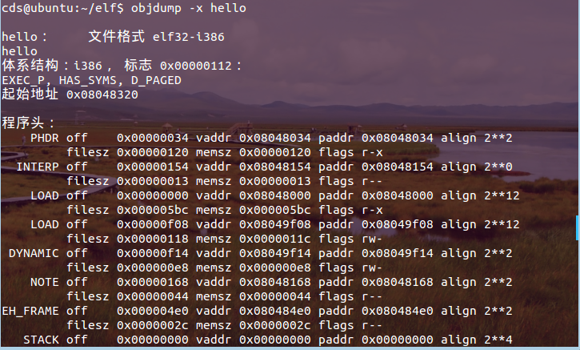

# linux第三次实践：ELF文件格式分析 - 海的沉淀 - 博客园

Tags: elf

[https://www.cnblogs.com/cdcode/p/5551649.html](https://www.cnblogs.com/cdcode/p/5551649.html)

标签（空格分隔）： 20135328陈都

## 一、概述

1.ELF全称Executable and Linkable Format,可执行连接格式，ELF格式的文件用于存储Linux程序。ELF文件（目标文件）格式主要三种：

- 可重定向文件：文件保存着代码和适当的数据，用来和其他的目标文件一起来创建一个可执行文件或者是一个共享目标文件。（目标文件或者静态库文件，即linux通常后缀为.a和.o的文件）
- 可执行文件：文件保存着一个用来执行的程序。（例如bash，gcc等）
- 共享目标文件：共享库。文件保存着代码和合适的数据，用来被下连接编辑器和动态链接器链接。（linux下后缀为.so的文件。） 目标文件既要参与程序链接又要参与程序执行：

一般的 ELF 文件包括三个索引表：ELF header，Program header table，Section header table。

- ELF header：在文件的开始，保存了路线图，描述了该文件的组织情况。
- Program header table：告诉系统如何创建进程映像。用来构造进程映像的目标文件必须具有程序头部表，可重定位文件不需要这个表。
- Section header table：包含了描述文件节区的信息，每个节区在表中都有一项，每一项给出诸如节区名称、节区大小这类信息。用于链接的目标文件必须包含节区头部表，其他目标文件可以有，也可以没有这个表。

## 二、分析ELF文件头（ELF header）

- 
    
    进入终端输入:cd /usr/include 进入include文件夹后查看elf.h文件，查看ELF的文件头包含整个文件的控制结构 
    
    
    
- 
    
    写一个小程序（hello 20135328）进行编译，生成hello可执行文件。 使用‘readelf –a hello’命令，都得到下面的ELF Header头文件的信息，如下图： 
    
    
    
    
    
- 
    
    通过上图信息，可以得出Elf Header的Size为52bytes，所以可以使用hexdump工具将头文件的16进制表打开。 如下图使用：‘hexdump -x hello -n 52 ’命令来查看hello文件头的16进制表（前52bytes）对格式进行分析。 
    
    
    
- 
    
    第一行
    
    - 对应e_ident[EI_NIDENT]。实际表示内容为7f454c46010100010000000000000000,前四个字节7f454c46(0x45,0x4c,0x46是'e','l','f'对应的ascii编码）是一个魔数，表示这是一个ELF对象。
    - 接下来的一个字节01表示是一个32位对象，接下来的一个字节01表示是小端法表示，再接下来的一个字节01表示文件头版本。剩下的默认都设置为0.
- 
    
    第二行
    
    - e_type值为0x0002，表示是一个可执行文件
    - 。e_machine值为0x003e，表示是Advanced Micro Devices X86-64处理器体系结构。
    - e_version值为0x00000001，表示是当前版本。
    - e_entry值为0x 08048320，表示入口点。
- 
    
    第三行
    
    - e_phof f值为0x1178，表示程序头表。
    - e_shoff值为0x0034，表示段表的偏移地址。
- 
    
    第四行
    
    - e_flags值为0x001e，表示未知处理器特定标志。
    - e_ehsize值为0x0034，表示elf文件头大小（正好是52bytes）。
    - e_phentsize表示一个program header表中的入口的长度，值为0x0020。
    - e_phnum的值为0x0009，给出program header表中的入口数目。
    - e_shentsize值为0x0028表示段头大小为40个字节。e_shnum值为0x001e，表示段表入口有30个。
    - e_shstrndx值为0x001b，表示段名串表的在段表中的索引号。

## 三、通过文件头找到section header table，理解其内容

- file elf显示生成的目标文件hello的类型
- elf是一个可执行文件。输入：ls –l hello查看hello的大小：
    
    
    
- 如图可知，hello大小为7336字节。 输入：hexdump –x hello来用16进制的数字来显示hello的内容 （其中，第二列是16进制表示的偏移地址）
    
    
    
    输入：objdump –x hello来显示hello中各个段以及符号表的相关信息:
    
- 
    
    
    
    输入：readelf –a hello来查看各个段信息：
    
- ELF文件头信息：
    
    
    
    段表Section header table：
    
- 
    
    
    
    符号表 Symbol table：
    
- 
    
    
    
    
    
    
    

## 四、通过section header table找到各section

在一个ELF文件中有一个section header table，通过它我们可以定位到所有的 section，而 ELF header 中的e_shoff 变量就是保存 section header table 入口对文件头的偏移量。而每个 section 都会对应一个 section header ，所以只要在 section header table 中找到每个 section header，就可以通过 section header 找到你想要的 section。

下面以可执行文件hello为例，以保存代码段的 section 为例来讲解读取某个section 的过程。 使用‘vi /usr/include/elf.h ’命令查看Sections Header的结构体：

由上面分析可知，section headers table中的每一个section header所占的size均为64字节，ELF header得到了e_shoff变量的值为0X0034，也就是table入口的偏移量，通过看e_shnum值为0x001e，表示段表入口有30个。 所以从0x00000034开始有30个段，每个段占40个字节大小，输入 hexdump hello查看：

- 
    
    第一个段，其中内容全部为0，所以不表示任何段。
    
- 
    
    第二个段，为.interp段
    
- 
    
    第三个段，为.note.ABI-tag段
    
- 
    
    第四个段，为.note.gnu.build-i段
    
- 
    
    第五个段，为.gnu.hash段
    

.......

- 
    
    第十四个段，为.text段
    
- 
    
    第十六个段，为.rodata段
    
- 
    
    第二十五个段，为.data段
    
- 
    
    第二十六个段，为.bss段
    
- 
    
    第二十九个段， 为.symtab段
    
- 
    
    第三十个段， 为.strtab段
    

我们用readelf 命令去查看.text这个 section 中的内容， 输入readelf –x 13 hello，（.text前面的标号为13）对13索引号的.text的section的内容进行查看：

下面用 hexdump 的方法去读取.text这个 section 中的内容，通过看section header中.text中offset和size分别是0x320和0x192 输入 hexdump –C hello 找到320后的192个

得到了和上面的readelf得到的相同。 使用下面命令对hello的文本段（.text）进行反汇编： objdump –d hello 得到如下图：

可以看出，使用反汇编的16进制数据和前面查找到的是相同的。

## 五、理解常见.text .strtab .symtab .rodata等section

1. **text section**是可执行指令的集合，.data和.text都是属于PROGBITS类型的section，这是将来要运行的程序与代码。查询段表可知.text section的位偏移为0x0000320，size为0x0000192。
2. **strtab section**是属于STRTAB类型的section，可以在文件中看到，它存着字符串，储存着符号的名字。位偏移为0x000106f，size为0x0000106
3. **symtab section**存放所有section中定义的符号名字，比如“data_items”，“start_loop”。 .symtab section是属于SYMTAB类型的section，它描述了.strtab中的符号在“内存”中对应的“内存地址”。 位偏移为0x0001628，size为0x0000430。
4. **rodata section**，ro代表read only。位偏移为0x000050c，size为0x00000b0。