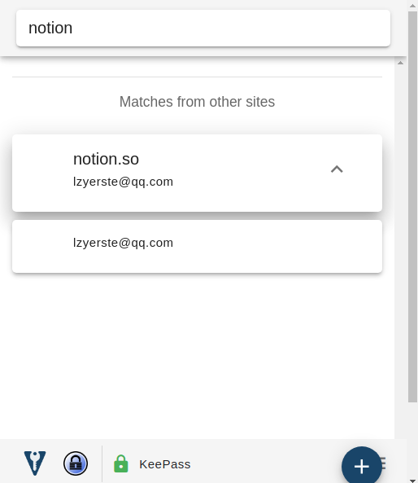

# keepass + chrome插件

使用插件：Kee

- chrome安装插件Kee
- 系统安装mono-complete
- 下载keepassrpc
    - [https://github.com/kee-org/keepassrpc](https://github.com/kee-org/keepassrpc)
    - 文件拷贝到/usr/lib/keepass2/Plugins
- 重启keepass客户端，会提示Kee想连接，生成验证码，填到chrome插件Kee即可。
- keepass需要常驻后台，不能锁定。

