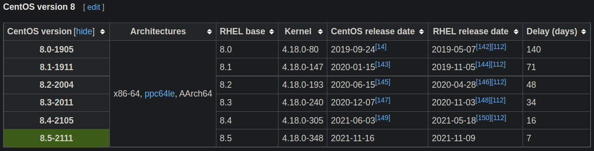
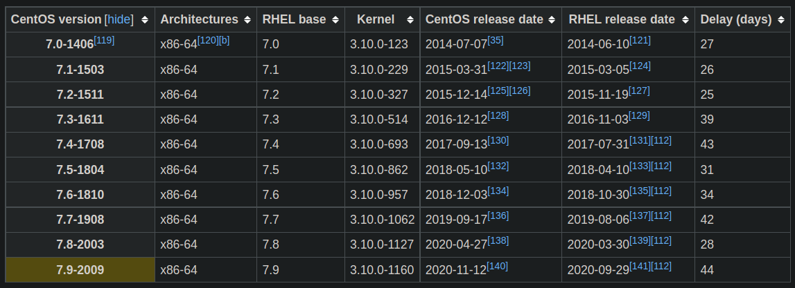

# CentOS [wiki]

[centos资源汇总](centos/centos资源汇总.md)

[双系统安装](centos/双系统安装.md)

[CentOS内核版本对应关系](centos/CentOS内核版本对应关系.md)

[CentOS 5.6](centos/CentOS%205%206.md)

[虚拟机安装](centos/虚拟机安装.md)

[RPM包安装](centos/RPM包安装.md)

[查看RPM包内容](centos/查看RPM包内容.md)

[使用简单密码](centos/使用简单密码.md)

[创建用户](centos/创建用户.md)

[grub2](centos/grub2.md)

[hostname](centos/hostname.md)

[系统分区](centos/系统分区.md)

CentOS 6只能安装到主分区？看不到扩展分区选项。

[kdump](centos/kdump.md)

[安装不同内核](centos/安装不同内核.md)

[memtester，内存压力测试工具](centos/memtester，内存压力测试工具.md)

[memtest启动项](centos/memtest启动项.md)

[禁用一些源](centos/禁用一些源.md)

[centos内核代码？](centos/centos内核代码？.md)

[异常处理](centos/异常处理.md)

centos 163镜像：[http://mirrors.163.com/centos/7/isos/x86_64/](http://mirrors.163.com/centos/7/isos/x86_64/)

[同步时间](centos/同步时间.md)

## 安装软件

```jsx
sudo yum install app
```

## 卸载软件

```jsx
sudo yum remove app
```

## ssh免密登录

注意文件权限。

[ssh 免密码登录（设置后仍需输密码的原因及解决方法） - shi_xin的专栏 - CSDN博客](https://blog.csdn.net/shi_xin/article/details/81392033)

## 内核版本

### CentOS 8



### CentOS 7

