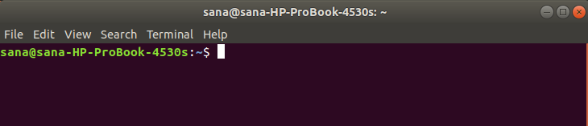
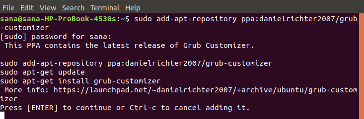
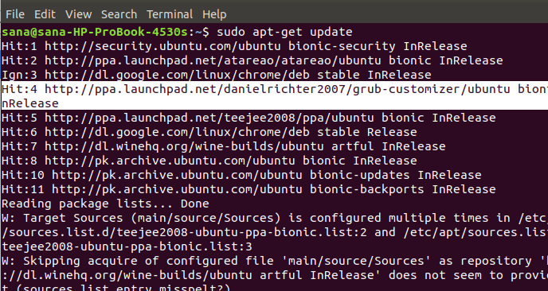
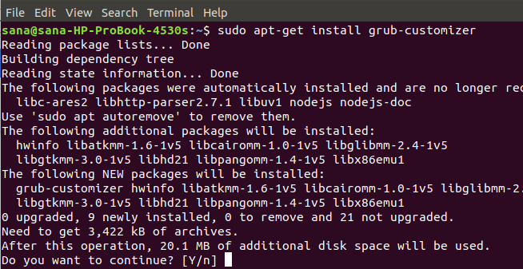
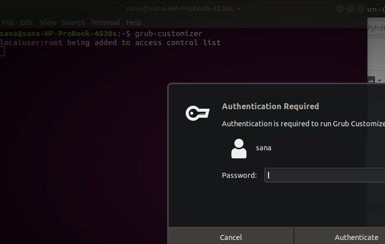
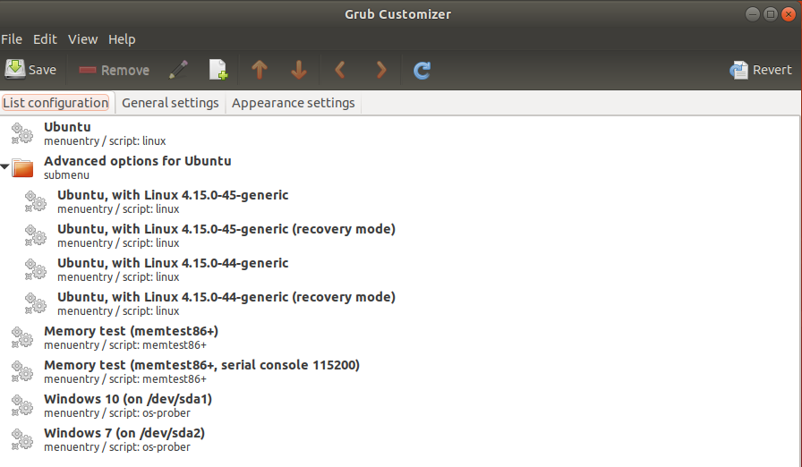
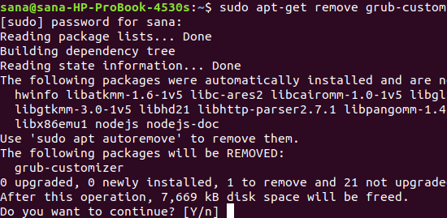
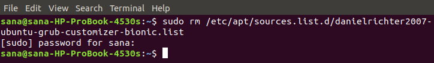

#grub

[grub](../../../../tech/grub.md)

[grub2](../grub2.md)

# grub customizer

[](https://vitux.com/how-to-install-grub-customizer-on-ubuntu/#:~:text=Grub Customizer is a useful,boot from the default entry)

```c
sudo add-apt-repository ppa:danielrichter2007/grub-customizer
sudo apt-get update
sudo apt-get install grub-customizer
```

Grub Customizer is a useful UI tool for changing the default settings of the Grub boot loader. With this tool, you can add, remove and rearrange boot menu entries. You can edit kernel parameters and also change the boot time delay to boot from the default entry. The software also allows you to make cosmetic configurations, such as changing the text color and background image.

In this article, we will explain how to install, launch and remove the software from your Ubuntu system. We have run the commands and procedures mentioned in this article on an Ubuntu 18.04 and Ubuntu 20.04 LTS system.

## How to Install Grub Customizer

### Step 1: Open the Terminal application

Open your Ubuntu command line, the Terminal, either through the system Dash or the Ctrl+Alt+T shortcut.



### Step 2: Add Grub Customizer PPA repository to your system

Enter the following command in order to add the Grub Customizer PPA repository to your system. This will help you in installing the required software, and also enable your system to fetch upgrades and updates from the added repository in the future.

$ sudo add-apt-repository ppa:danielrichter2007/grub-customizer

Tip: Instead of typing the command, you can copy it from here and paste into the Terminal by using the Ctrl+Shift+V, or by using the Paste option from the right-click menu.



Please note that only an authorized user can add, remove and configure software on Ubuntu. Enter the password for sudo, after which the PPA repository will be added to your system.

### Step 3: Upgrade your system’s Repository Index

The next step is to update your system’s repository index through the following command:

$ sudo apt-get update

This helps you in installing the latest available version of a software from the Internet.



### Step 4: Install Grub Customizer

Now that you are done with all the prerequisites required to install the Grub Customizer, use the following command as sudo in order to install it on your system:

$ sudo apt-get install grub-customizer



The system will prompt you with a Y/n option to proceed with the installation procedure. Enter Y to continue after which the software will be installed on your system.

### Step 5: Verify Grub Customizer Installation

After you have installed the Grub Customizer, you can use one of the following two options to ensure that it is indeed installed on your system:

$ grub-customizer --version

$ grub-customizer -v


The above output shows that Grub Customizer version 5.1.0, which is the latest version of the software, is installed on my system.

## Launch Grub Customizer

You can launch the Grub Customizer through the command line by entering the following command:

$ grub-customizer



The software requires root access to run the software as only an authorized user can make configurations to the system Grub.

Enter the password for root and click the Authenticate button after which the Grub Customizer’s UI will launch on your system.

Alternatively, you can launch the software through the system Dash search results as follows:


This is how the Grub Customizer UI looks like:



## How to Uninstall?

If you ever want to remove the Grub Customizer from your system, you can do so by entering the following command in your Ubuntu Terminal:

$ sudo apt-get remove grub-customizer



The system will prompt you with a Y/n option to proceed with the uninstall procedure. Enter Y to continue after which the software will be removed from your system.

If you no longer want to keep the PPA repository that you had used to install the Grub Customizer, you can remove it by using the following command:

$ sudo rm /etc/apt/sources.list.d/danielrichter2007-ubuntu-grub-customizer-bionic.list



Alternatively, you can use Software & Updates utility from the GUI in order to remove the PPA.

You can explore the true potential of the Grub Installer by installing it and giving a new look, feel, and behavior to your Grub boot loader.