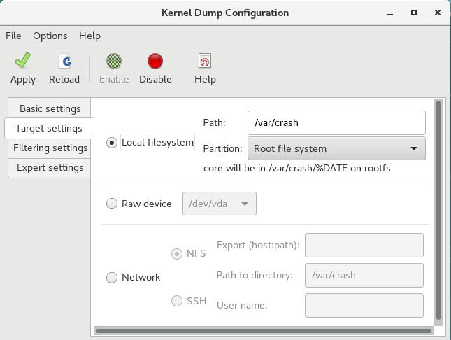
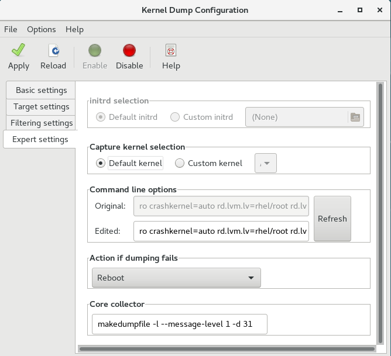

# Chapter 7. Kernel crash dump guide Red Hat Enterprise Linux 7 | Red Hat Customer Portal

[https://access.redhat.com/documentation/en-us/red_hat_enterprise_linux/7/html/kernel_administration_guide/kernel_crash_dump_guide](https://access.redhat.com/documentation/en-us/red_hat_enterprise_linux/7/html/kernel_administration_guide/kernel_crash_dump_guide)

**Kdump** is a kernel crash dumping mechanism that allows you to save the contents of the system’s memory for later analysis. It relies on **kexec**, which can be used to boot a Linux kernel from the context of another kernel, bypass BIOS, and preserve the contents of the first kernel’s memory that would otherwise be lost.

In case of a system crash, kdump uses kexec to boot into a second kernel (a *capture kernel*). This second kernel resides in a reserved part of the system memory that is inaccessible to the first kernel. The second kernel then captures the contents of the crashed kernel’s memory (a *crash dump*) and saves it.

A kernel crash dump can be the only information available in the event of a failure, the importance of having this data in a business critical environment cannot be underestimated. Red Hat advises that System Administrators regularly update and test `kexec-tools` in your normal kernel update cycle. This is especially important when new kernel features are implemented.

HP Watchdog timer (*hpwdt*) driver is pre-loaded in HP systems running as a RHEV hypervisor, so these systems can consume the NMI watchdog. Updated kexec-tools packages starting with *kexec-tools-2.0.15-33.el7.x86_64* have preloaded the *hpwdt* driver.

If drivers *bnx2x* and *bmx2fc* are not blacklisted in the kdump kernel then the second kernel leads to panic and the dumps will not be captured.

In order for kdump to be able to capture a kernel crash dump and save it for further analysis, a part of the system memory has to be permanently reserved for the capture kernel. When reserved, this part of the system memory is not available to main kernel.

The memory requirements vary based on certain system parameters. One of the major factors is the system’s hardware architecture. To find out the exact name of the machine architecture (such as `x86_64`) and print it to standard output, type the following command at a shell prompt:

```
uname -m
```

Another factor which influences the amount of memory to be reserved is the total amount of installed system memory. For example, on the x86_64 architecture, the amount of reserved memory is 160 MB + 2 bits for every 4 KB of RAM. On a system with 1 TB of total physical memory installed, this means 224 MB (160 MB + 64 MB). For a complete list of memory requirements for kdump based on the system architecture and the amount of physical memory, see [Section 7.8.1, “Memory requirements for kdump”](https://access.redhat.com/documentation/en-us/red_hat_enterprise_linux/7/html/kernel_administration_guide/kernel_crash_dump_guide).

On many systems, kdump can estimate the amount of required memory and reserve it automatically. This behavior is enabled by default, but only works on systems that have more than a certain amount of total available memory, which varies based on the system architecture. See [Section 7.8.2, “Minimum threshold for automatic memory reservation”](https://access.redhat.com/documentation/en-us/red_hat_enterprise_linux/7/html/kernel_administration_guide/kernel_crash_dump_guide) for a list of minimum requirements for automatic memory reservation based on the system architecture.

If the system has less than the minimum amount of memory required for the automatic allocation to work or if your use case requires a different value, you can configure the amount of reserved memory manually. For information on how to do so on the command line, see [Section 7.2.2.1, “Configuring the memory usage”](https://access.redhat.com/documentation/en-us/red_hat_enterprise_linux/7/html/kernel_administration_guide/kernel_crash_dump_guide). For information on how to configure the amount of reserved memory in the graphical user interface, see [Section 7.2.3.1, “Configuring the memory usage”](https://access.redhat.com/documentation/en-us/red_hat_enterprise_linux/7/html/kernel_administration_guide/kernel_crash_dump_guide).

It is highly recommended to test the configuration after setting up the kdump service, even when using the automatic memory reservation. For instructions on how to test your configuration, see [Section 7.4, “Testing the kdump configuration”](https://access.redhat.com/documentation/en-us/red_hat_enterprise_linux/7/html/kernel_administration_guide/kernel_crash_dump_guide).



