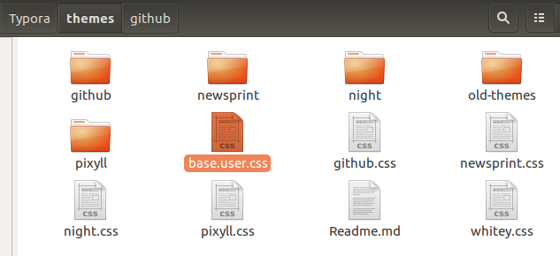
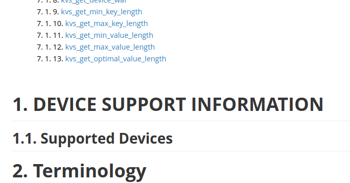

#typora #神器 #必备

2021-11-29 19:58:39，正式版要收费，$15，3台设备。

# Typora

Ubuntu下安装：可以直接下载 deb 安装包

```bash
# or run:
# sudo apt-key adv --keyserver keyserver.ubuntu.com --recv-keys BA300B7755AFCFAE
wget -qO - https://typora.io/linux/public-key.asc | sudo apt-key add -
# add Typora's repository
sudo add-apt-repository 'deb https://typora.io/linux ./'
sudo apt-get update
# install typora
sudo apt-get install typora
```

---

- MAC的命令行中调用typora：`alias typora="open -a typora"`
  
    [Use Typora from Shell or Cmd](https://support.typora.io/Use-Typora-From-Shell-or-cmd/)
    

类似的markdown编辑器

[marktext/marktext](https://github.com/marktext/marktext)

## 激活

> [!NOTE]+ Activation key
> 2Y8PGX-R3TL7W-HERL5M-MUDDNV
> lzyerste@qq.com

只支持 3 台机器，可以让某台下线。

## 标题自动编号

[Auto Numbering for Headings](https://support.typora.io/Auto-Numbering/)

下面的更好，TOC目录也有编号：

[[CSS] TOC Autonumbering for Typora - Pastebin.com](https://pastebin.com/NYugSbXk)

把这段css保存到typora的theme目录即可，文件名为user.base.css



效果如下：

