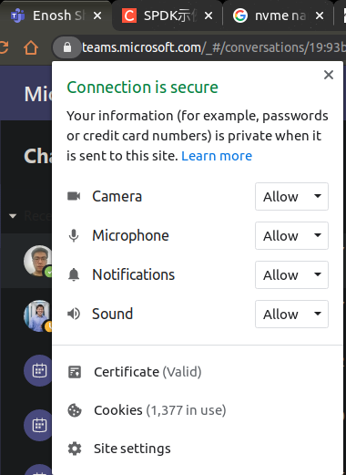
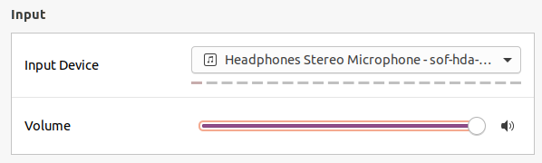
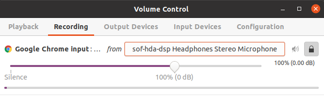
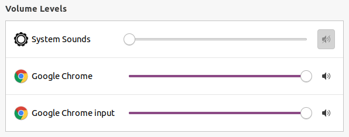
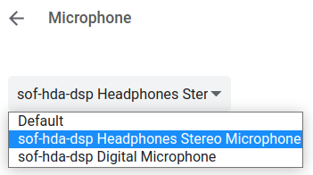
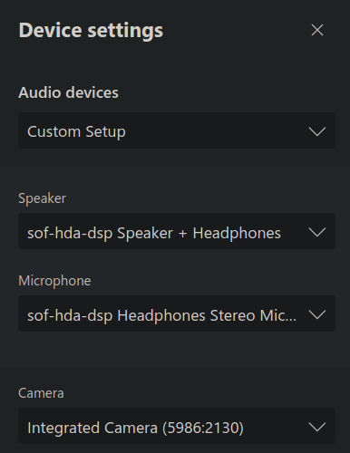
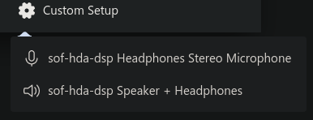

# 耳机麦克风没声音

tag: 耳机 麦克风 没声音

场景：Chrome浏览器，微软teams连麦能听到，说话没声音。

在线麦克风测试：

[Microphone Test - Check Your Mic With Our Online Tool | OnlineMicTest](https://www.onlinemictest.com/)

## 解决

1. 检查Chrome是否开启权限。
    
    
    
2. ubuntu系统的输入设备是否选择耳机麦克风。
    
    
    
3. 打开PulseAudio Volume Control（需要另外安装软件），查看Recording中Chrome的输入设备是什么，改为耳机麦克风。
    
    
    
4. 这时候，回到ubuntu系统的设置，能够看到Chrome项了。

## 确认选择了耳机麦克风

- 微软teams使用过程中，还是自动选择了笔记本的麦克风，需要更改。
- chrome设置默认麦克风为耳机
    1. Open Chrome .
    2. At the top right, click More → **Settings**.
    3. Under "Privacy and security," click **Site settings → Microphone**.
    4. To select a default microphone, click the Down arrow ↓.
        
        
        
- 微软teams选择耳机麦克风

## 声卡驱动损坏

大约10来天，就损坏，没声音了。固件版本为1.4。

更新固件试一下。

[thesofproject/sof-bin](https://github.com/thesofproject/sof-bin/tree/stable-v1.6.1)