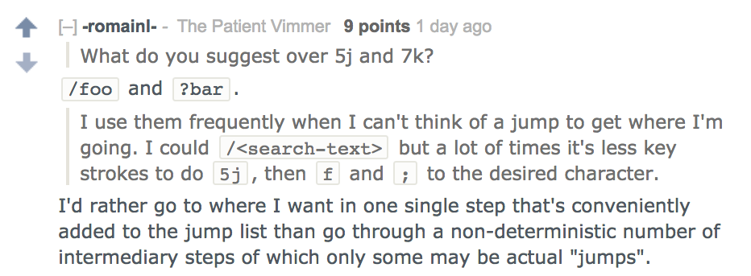
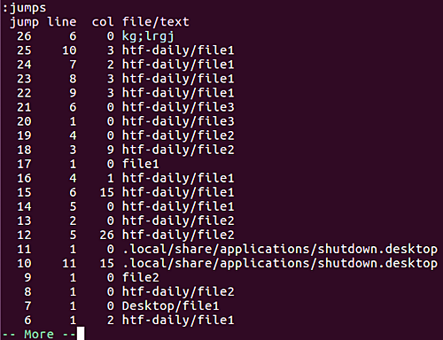
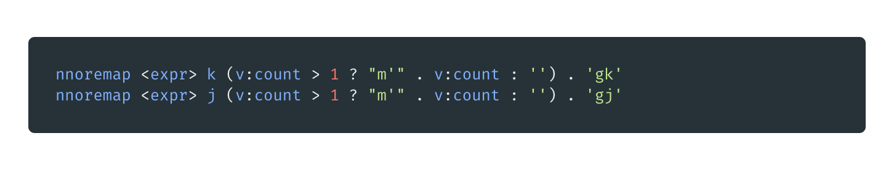

# Understanding Vim’s Jump List. One of the great joys of Vim is its… | by Kade Killary | Medium

[https://medium.com/breathe-publication/understanding-vims-jump-list-7e1bfc72cdf0](https://medium.com/breathe-publication/understanding-vims-jump-list-7e1bfc72cdf0)

One of the great joys of Vim is its endless learning. Recently, I published an article describing *[what I wish I knew when starting Vim](https://hackernoon.com/learning-vim-what-i-wish-i-knew-b5dca186bef7)*. Well, jump lists has now catapulted to the top of that list.

So, what exactly is this *jump list*?

Let’s start where all good Vim searches do — `:help jumplist`.

> Jumps are remembered in a jump list. With the `CTRL-o` and `CTRL-i` command you can go to cursor positions before older jumps, and back again. Thus you can move up and down the list. There is a separate jump list for each window.
> 

Sounds cool enough, but why use it? In my former piece I outlined how I utilized relative numbers to race from one line to another. This method relies on using a count + directional key. So, 4j will move me down four lines from where I currently am within Vim. This seems well enough, but actually has a hidden weakness. Motions like 4j and 10k, while convenient, aren’t technically jumps. Surprised? Me too! This wasn’t obvious to me until reddit user *[romainl](https://www.reddit.com/user/-romainl-)* laid out his case.

Thus, what quantifies as a jump?

Each one of the listed keys in the image above will count as a jump. This is important because these motions contribute to the jump list. You can view the jump list at anytime by typing — :jumps. You can also clear said list by typing — :clearjumps. You can also explicitly add a jump by setting the ‘ mark with “m’”.

Example jump list

One of the hidden benefits of this approach is quick navigation within a project. Using CTRL-o and CTRL-i, you can go back and forth throughout your project across files. So far, I’ve enjoyed this added quirk quite a bit.

Another wrinkle with jump lists is the ability to move to a specific jump. For instance, if you wanted to change to your cursor position three jumps ago — 3g;

g; — go to [count] older positions in change list

g, — go to [count] new cursor positions in change list

If you want a quick reminder of where you want to move type — :changes. This will open the change list with change number, line number and the text — an amazing feature.

If you want j and k to be added to the jump list, you can do so using a mark. Reddit user PlayMeWhile provided the following solution. Add this to your .vimrc and CTRL-o and i will work as expected.

Add this in your .vimrc

As always, Vim continues to be an endless wonder of features. I’ve currently removed relative numbers and have switched to all jumps. So far, I’m impressed and think this may be my permanent method of transport within Vim.

Special thanks to [r/Vim](https://www.reddit.com/r/vim/) and romainl for all the good advice!