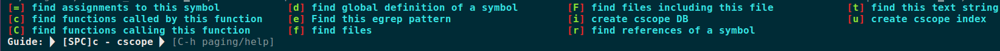

# spacevim

[Home](https://spacevim.org/)

## grep on the fly

```python
<SPC> s /keyword
```

## ctags

```python
# 产生文件tags
ctags -R
```

vim中使用：

```python
# jump to denination
:tj function-name
```

```python
# go to defination，当前光标
gD

或者

g <Ctrl> ]
```

## cscope

```python
# 产生文件cscope.in.out, cscope.out, cscope.po.out
cscope -Rbkq
```

spacevim中使用：

```python
查看某函数被谁引用：
<SPC> m c r
```

<SPC> m效果：

