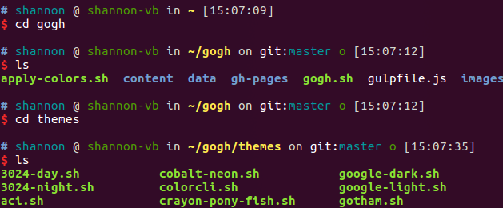
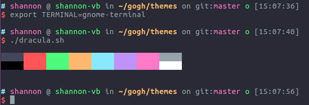

# dracula主题

[Mayccoll/Gogh](https://github.com/Mayccoll/Gogh)

## ubuntu安装

```python
# clone the repo into "$HOME/src/gogh"
mkdir -p "$HOME/src"
cd "$HOME/src"
git clone https://github.com/Mayccoll/Gogh.git gogh
cd gogh/themes

# necessary on ubuntu
export TERMINAL=gnome-terminal

# install themes
./atom.sh
./dracula.sh
```

安装前：



安装后并选择Dracula主题（Terminal，右键，Profiles，选择Dracula）：

