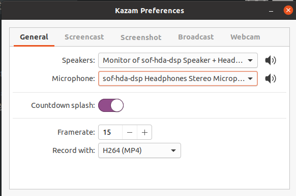
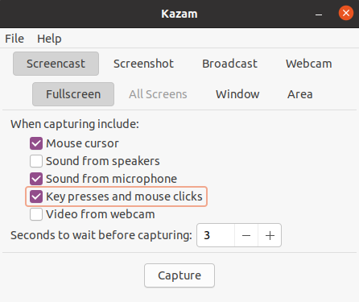

# 录屏软件

## Ubuntu，kazam

[Record Screen in Ubuntu Linux With Kazam [Beginner's Guide] - It's FOSS](https://itsfoss.com/kazam-screen-recorder/)

安装最新版kazam：

```c
sudo add-apt-repository ppa:sylvain-pineau/kazam
sudo apt-get update
sudo apt install kazam python3-cairo python3-xlib
```

输入声音可以设置为耳机麦克风。

录屏时系统图标看不到，可以使用快捷键结束录制，Ctrl+Win+F。



