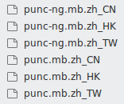

# 搜狗输入法

Ubuntu下直接安装deb，重启即可。

将中文下的乘号也修改为英文的乘号（用于markdown的列表符号）：

[linux 下，fcitx 输入法的直角引号设置](https://www.xianmin.org/post/linux-fcitx-punc/)



---

禁用全角快捷键：

[Ubuntu关闭全角半角切换的快捷键](https://www.jianshu.com/p/6b833abc8114)

## ubuntu 下自定义词语

直接在搜狗输入法的设置里添加就行，跟 windows 一样。

---

以下不看。

下面是针对系统自带的，搜狗输入法不在这里设置。

Input Method Configuration -> Addon -> Quickphrase


## 左边shift会切换输入法

[https://askubuntu.com/questions/752324/fcitx-extra-key-for-trigger-input-method-changes-back-to-default-after-restart](https://askubuntu.com/questions/752324/fcitx-extra-key-for-trigger-input-method-changes-back-to-default-after-restart)


按左边的shift会触发切换输入法，而不是切换中英文。

直接在fcitx界面改成R_SHIFT，它好像会变回去。

修改配置文件.config/fcitx/config，里面改为R_SHIFT

```jsx
SwitchKey=R_SHIFT
```

将文件权限改为只读，防止被修改。

```jsx
cd ~/.config/fcitx
chmod 444 config
chmod 400 profile
```