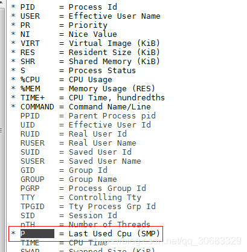
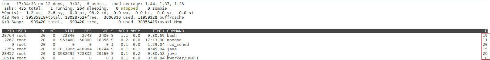

# Linux绑定CPU运行指定进程（绑核）-taskset_此心光明，亦复何言~-CSDN博客

[https://blog.csdn.net/qq_30683329/article/details/88779390](https://blog.csdn.net/qq_30683329/article/details/88779390)

# **Linux绑定CPU运行指定进程**

# **前言**

最近在arm上测试一些节点的性能，发现节点性能变化很大，尤其是当有其他高消耗的资源起来后，性能就会变得相当不稳定，因此怀疑是多个进程在争抢一个CPU的资源，从而导致该节点的性能变化过大。

# **如何查看Linux核数**

```
# 总核数 = 物理CPU个数 X 每颗物理CPU的核数 
# 总逻辑CPU数 = 物理CPU个数 X 每颗物理CPU的核数 X 超线程数

# 查看物理CPU个数
cat /proc/cpuinfo| grep "physical id"| sort| uniq| wc -l

# 查看每个物理CPU中core的个数(即核数)
cat /proc/cpuinfo| grep "cpu cores"| uniq

# 查看逻辑CPU的个数
cat /proc/cpuinfo| grep "processor"| wc -l
1234567891011
```

# **如何绑定CPU**

这里就要说到linux中的taskset命令了，通过该命令，我们可以将一个启动的进程直接绑定在某个核上运行，首先taskset的最基本的绑定方式就是：

```
# cpu-list可以是0,1这样的一个核，也可以是1-2这样的，表示绑定在1和2上面
# pid 表示进程号
taskset -cp cpu-list pid
123
```

例如说：

```
taskset -cp 1-3 1927
1
```

这句命令就是表示将进程号为1927的进程绑定在核1,2,3上。

# **如何确认绑定成功**

这时候就可以通过top命令来进行查看，首先执行top命令，就可以看到相应的资源消耗，然后按F，选择Last Used CPU，这时候可以使用空格选中。



然后再按ECS，就可以退回正常Top界面，这时候就可以看到这些进程跑在哪些核上，如果说Last Used CPU一直保持不变，那就说明绑定成功。

