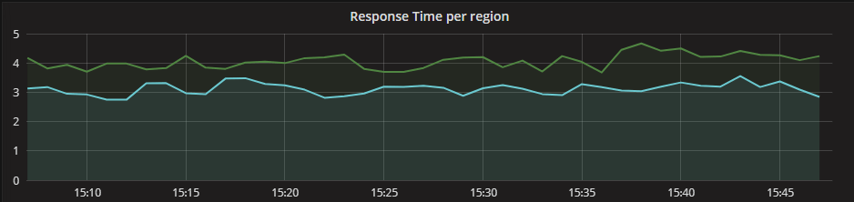

# Transparent Hugepages: measuring the performance impact - The mole is digging

[https://alexandrnikitin.github.io/blog/transparent-hugepages-measuring-the-performance-impact/](https://alexandrnikitin.github.io/blog/transparent-hugepages-measuring-the-performance-impact/)

TL;DR This post explains Transparent Hugepages (THP) in a nutshell, describes techniques that can be used to measure the performance impact, shows the effect on a real-world application.

The post was inspired by [a thread about Transparent Hugepages](https://groups.google.com/forum/#!topic/mechanical-sympathy/sljzehnCNZU) on the Mechanical Sympathy group. The thread walks through the pitfalls, performance numbers and current state in the latest kernel versions. A lot of useful information is there. In general, you can find many recommendations on the Internet. Many of them tell you to disable THP, e.g. [Oracle Database](http://docs.oracle.com/cd/E11882_01/install.112/e47689/pre_install.htm#LADBI1519), [MongoDB](https://docs.mongodb.com/manual/tutorial/transparent-huge-pages/), [Couchbase](https://developer.couchbase.com/documentation/server/current/install/thp-disable.html), [MemSQL](https://help.memsql.com/hc/en-us/articles/115002948663-Disable-Transparent-Huge-Pages), [NuoDB](http://doc.nuodb.com/Latest/Content/Note-About-%20Using-Transparent-Huge-Pages.htm) . Few of them utilize the feature, e.g. [PostgreSQL](https://www.postgresql.org/docs/9.6/static/kernel-resources.html#LINUX-HUGE-PAGES) (hugetlbpage feature, not THP) and [Vertica](https://my.vertica.com/docs/7.2.x/HTML/index.htm#Authoring/InstallationGuide/BeforeYouInstall/transparenthugepages.htm). There are quite a few stories telling how people fight a system freeze and solved it disabling the THP feature. [1](https://www.perforce.com/blog/tales-field-taming-transparent-huge-pages-linux), [2](https://community.microfocus.com/borland/managetrack/accurev/w/accurev_knowledge_base/27749/recommendation-to-disable-linux-kernel-transparent-hugepages-thp-setting-for-performance-improvement), [3](http://structureddata.org/2012/06/18/linux-6-transparent-huge-pages-and-hadoop-workloads/), [4](https://blogs.oracle.com/linux/performance-issues-with-transparent-huge-pages-thp), [5](https://dzone.com/articles/why-tokudb-hates-transparent), [6](https://engineering.linkedin.com/performance/optimizing-linux-memory-management-low-latency-high-throughput-databases). All those stories lead to distorted view and preconception that the feature is harmful.

Unfortunately, I couldn’t find any post that measures or shows how to measure the impact and consequences of enabling/ disabling the feature. This is what this post is supposed to address.

## Transparent Hugepages in a nutshell

Almost all applications and OSes run in virtual memory. Virtual memory is mapped into physical memory. The mapping is managed by an OS maintaining [the page tables data structure](https://en.wikipedia.org/wiki/Page_table) in RAM. The address translation logic (page table walking) is implemented by [the CPU’s memory management unit (MMU)](https://en.wikipedia.org/wiki/Memory_management_unit). The MMU also has a cache of recently used pages. This cache is called the Translation lookaside buffer (TLB).

“When a virtual address needs to be translated into a physical address, the TLB is searched first. If a match is found (a TLB hit), the physical address is returned and memory access can continue. However, if there is no match (called a TLB miss), the MMU will typically look up the address mapping in the page table to see whether a mapping exists.” The page table walk is expensive because it may require multiple memory accesses (they may hit the CPU L1/L2/L3 caches though). On the other side, the TLB cache size is limited and typically can hold several hundred pages.

OSes manage virtual memory using pages (contiguous block of memory). Typically, the size of a memory page is 4 KB. 1 GB of memory is 256 000 pages; 128 GB is 32 768 000 pages. Obviously TLB cache can’t fit all of the pages and performance suffers from cache misses. There are two main ways to improve it. The first one is to increase TLB size, which is expensive and won’t help significantly. Another one is to increase the page size and therefore have less pages to map. Modern OSes and CPUs support large 2 MB and even 1 GB pages. Using large 2 MB pages, 128 GB of memory becomes just 64 000 pages.

That’s the reason there is Linux Transparent Hugepage Support in Linux. It’s an optimization! It manages large pages automatically and transparently for applications. The benefits are pretty obvious: no changes required on application side; it reduces the number of TLB misses; page table walking becomes cheaper. The feature logically can be divided into two parts: allocation and maintenance. The THP takes the regular (“higher-order”) memory allocation path and it requires that the OS be able to find contiguous and aligned block of memory. It suffers from the same issues as the regular pages, namely fragmentation. If the OS can’t find a contiguous block of memory, it will try to compact, reclaim or page out other pages. That process is expensive and **could cause latency spikes (up to seconds)**. This issue was addressed in the 4.6 kernel (via “defer” option), the OS falls back to a regular page if it can’t allocate a large one. The second part is maintenance. Even if an application touches just 1 byte of memory, it will consume whole 2 MB large page. This is obviously a waste of memory. So there’s a background kernel thread called “khugepaged”. It scans pages and tries to defragment and collapse them into one huge page. Despite it’s a background thread, it locks pages it works with, hence **could cause latency spikes** too. Another pitfall lays in large page splitting, not all parts of the OS work with large pages, e.g. swap. The OS splits large pages into regular ones for them. It could also degrade the performance and increase memory fragmentation.

The best place to read about Transparent Hugepage Support is the official documentation on [the Linux Kernel website](https://www.kernel.org/doc/Documentation/vm/transhuge.txt). The feature has several settings and flags that affect its behavior and they evolve with the Linux kernel.

## How to measure?

This is the most crucial part and the goal of this post. Basically there are two ways to measure the impact: CPU counters and kernel functions.

Let’s start from the CPU counters. I use [perf](https://perf.wiki.kernel.org/index.php/Main_Page), which is a great and easy-to-use tool for that purpose. Perf has built-in event aliases for TLB: `dTLB-loads`, `dTLB-load-misses` for data loads hits and misses; `dTLB-stores`, `dTLB-store-misses` for data stores hits and misses.

```
[~]# perf stat -e dTLB-loads,dTLB-load-misses,dTLB-stores,dTLB-store-misses -a -I 1000
#           time             counts unit events
     1.006223197         85,144,535      dTLB-loads                                                    
     1.006223197          1,153,457      dTLB-load-misses          #    1.35% of all dTLB cache hits   
     1.006223197        153,092,544      dTLB-stores                                                   
     1.006223197            213,524      dTLB-store-misses                                             
...
```

Let’s not forget about instruction misses too: `iTLB-load`, `iTLB-load-misses`.

```
[~]# perf stat -e iTLB-load,iTLB-load-misses -a -I 1000
#           time             counts unit events
     1.005591635              5,496      iTLB-load
     1.005591635             18,799      iTLB-load-misses          #  342.05% of all iTLB cache hits
...
```

In fact, perf supports just a small subset of all events while CPUs have hundreds of various counters to monitor the performance. For Intel CPUs you can find all available counters on the [Intel Processor Event Reference website](https://download.01.org/perfmon/index/) or in [“Intel® 64 and IA-32 Architectures Developer’s Manual: Vol. 3B”](https://www.intel.com/content/www/us/en/architecture-and-technology/64-ia-32-architectures-software-developer-vol-3b-part-2-manual.html) or in [the Linux kernel sources](https://github.com/torvalds/linux/blob/510c8a899caf095cb13d09d203573deef15db2fe/tools/perf/pmu-events/arch/x86/haswell/virtual-memory.json). The Developer’s Manual also contains event codes that we need to pass to perf.

If we take a look at the TLB related counters, we could find the following most interesting for us:

[Untitled](assets/Untitled%20Database%20aac6c48ab7374ce8ad15a598fc40b4c5.csv)

Perf supports the `*MISS_CAUSES_A_WALK` counters via aliases. We need to use event numbers for others. The CPU event numbers and umask values are CPU specific; the listed above are for the Haswell microarchitecture. You need to look for codes for your CPU.

One of the key metrics is the number of CPU cycles spent in the page table walking:

```
[~]# perf stat -e cycles \
>   -e cpu/event=0x08,umask=0x10,name=dcycles/ \
>   -e cpu/event=0x85,umask=0x10,name=icycles/ \
>   -a -I 1000
#           time             counts unit events
     1.005079845        227,119,840      cycles
     1.005079845          2,605,237      dcycles
     1.005079845            806,076      icycles
...
```

Another important metric is the number of main memory reads caused by TLB miss; those reads miss the CPU caches hence quite expensive:

```
[root@PRCAPISV0003L01 ~]# perf stat -e cache-misses \
>   -e cpu/event=0xbc,umask=0x18,name=dreads/ \
>   -e cpu/event=0xbc,umask=0x28,name=ireads/ \
>   -a -I 1000
#           time             counts unit events
     1.007177568             25,322      cache-misses
     1.007177568                 23      dreads
     1.007177568                  5      ireads
...
```

Another powerful way to measure how TPH affects performance and latency is tracing/ probing Linux kernel functions. I use [SystemTap](https://sourceware.org/systemtap/) for that, which is “a tool for dynamically instrumenting running production Linux kernel-based operating systems.”

The first function that is interesting for us is `[__alloc_pages_slowpath](http://elixir.free-electrons.com/linux/v3.10/source/mm/page_alloc.c#L2391)`. It is executed when there’s no contiguous block of memory available for allocation. In its turn, this function calls expensive page compaction and reclamation logic that could cause latency spikes.

The second interesting function is `[khugepaged_scan_mm_slot](http://elixir.free-electrons.com/linux/v3.10/source/mm/huge_memory.c#L2466)`. It is executed by the background “khugepaged” kernel thread. It scans hugepages and tries to collapse them into one.

I use a SystemTap script to measure a function execution latency. The script stores all execution timings in microseconds and periodically outputs a logarithmic histogram. It consumes few megabytes per hour depending on number of executions. The first argument is a probe point, the second one is number of milliseconds to periodically print statistics.

```
#! /usr/bin/env stap
global start, intervals

probe $1 { start[tid()] = gettimeofday_us() }
probe $1.return
{
  t = gettimeofday_us()
  old_t = start[tid()]
  if (old_t) intervals <<< t - old_t
  delete start[tid()]
}

probe timer.ms($2)
{
    if (@count(intervals) > 0)
    {
        printf("%-25s:\n min:%dus avg:%dus max:%dus count:%d \n", tz_ctime(gettimeofday_s()),
             @min(intervals), @avg(intervals), @max(intervals), @count(intervals))
        print(@hist_log(intervals));
    }
}
```

Here’s an example for the `__alloc_pages_slowpath` function:

```
[~]# ./func_time_stats.stp 'kernel.function("__alloc_pages_slowpath")' 1000

Thu Aug 17 09:37:19 2017 CEST:
 min:0us avg:1us max:23us count:1538
value |-------------------------------------------------- count
    0 |@@@@@@@@@@@@@@@@@@@@@@@@@@@@@@@@@@@@@@@@@@@@@@@@@  549
    1 |@@@@@@@@@@@@@@@@@@@@@@@@@@@@@@@@@@@@@@@@@@@@@@@@@  541
    2 |@@@@@@@@@@@@@@@@@@@@@@@@@@@@@@@@@@                 377
    4 |@@@@                                                54
    8 |@                                                   12
   16 |                                                     5
   32 |                                                     0
   64 |                                                     0
...
```

It’s also worth to monitor the overall system state. For example the memory fragmentation state. `/proc/buddyinfo` “is a useful tool for helping diagnose these problems. Buddyinfo will give you a clue as to how big an area you can safely allocate, or why a previous allocation failed.” More information relevant to fragmentation can also be found in `/proc/pagetypeinfo`.

```
cat /proc/buddyinfo
cat /proc/pagetypeinfo
```

You can read more about it in [the official documentation](http://elixir.free-electrons.com/linux/v3.10.107/source/Documentation/filesystems/proc.txt#L691) or [in this post](http://andorian.blogspot.lt/2014/03/making-sense-of-procbuddyinfo.html).

## JVM

JVM supports Transparent Hugepages via the `-XX:+UseTransparentHugePages` flag. Although they warn about possible performance problems:

> -XX:+UseTransparentHugePages On Linux, enables the use of large pages that can dynamically grow or shrink. This option is disabled by default. You may encounter performance problems with transparent huge pages as the OS moves other pages around to create huge pages; this option is made available for experimentation.
> 

It is worth to enable the use of large pages for Metaspace too:

> -XX:+UseLargePagesInMetaspace Use large page memory in metaspace. Only used if UseLargePages is enabled.
> 

It may be a good idea to use hugepages with `-XX:+AlwaysPreTouch` options. It preallocates all physical memory used by the heap, hence avoids any further overhead for page initialization or compaction. But it takes more time to initialize the JVM.

> -XX:+AlwaysPreTouch Enables touching of every page on the Java heap during JVM initialization. This gets all pages into the memory before entering the main() method. The option can be used in testing to simulate a long-running system with all virtual memory mapped to physical memory. By default, this option is disabled and all pages are committed as JVM heap space fills.
> 

[Aleksey Shipilёv](http://twitter.com/shipilev) shows performance impact in microbenchmarks in [his “JVM Anatomy Park #2: Transparent Huge Pages” blog post](https://shipilev.net/jvm-anatomy-park/2-transparent-huge-pages/).

## A real-world case: High-load JVM

Let’s take a look at how Transparent Hugepages affect a real-world application. Given a JVM application: a high-load TCP server based on [netty](https://netty.io/). The server receives up to 100K requests per second, parses them, performs a network database call for each one, then does quite a lot of computations and returns a response back. The JVM application has 200 GB heap. The measurements were done on production servers and production load. Servers were not overloaded and received a half of the maximum number of requests they can handle.

### Transparent Hugepages is off

Let’s turn the THP off:

```
echo never > /sys/kernel/mm/transparent_hugepage/enabled
echo never > /sys/kernel/mm/transparent_hugepage/defrag
```

The first thing to measure is the number of TLB misses. We have ~130 million of TLB misses. Miss/hit rate is 1% (which doesn’t look too bad at first). The numbers:

```
[~]# perf stat -e dTLB-loads,dTLB-load-misses,iTLB-load-misses,dTLB-store-misses -a -I 1000
#           time             counts unit events
...
    10.007352573      9,426,212,726      dTLB-loads                                                    
    10.007352573         99,328,930      dTLB-load-misses          #    1.04% of all dTLB cache hits   
    10.007352573         26,021,651      iTLB-load-misses                                              
    10.007352573         10,955,696      dTLB-store-misses                                             
...
```

Let’s take a look how much those misses cost for the CPU:

```
[~]# perf stat -e cycles \
>   -e cpu/event=0x08,umask=0x10,name=dcycles/ \
>   -e cpu/event=0x85,umask=0x10,name=icycles/ \
>   -a -I 1000
#           time             counts unit events
...
    12.007998332     61,912,076,685      cycles
    12.007998332      5,615,887,228      dcycles
    12.007998332      1,049,159,484      icycles
...
```

Yes, you see it right! **More than 10%** of CPU cycles were spent doing the page table walking.

The following counters show us that we have 1 million RAM memory reads caused by TLB misses (which can be up to 100 ns each):

```
[~]# perf stat -e cpu/event=0xbc,umask=0x18,name=dreads/ \
>    -e cpu/event=0xbc,umask=0x28,name=ireads/ \
>    -a -I 1000
#           time             counts unit events
...
     6.003683030          1,087,179      dreads
     6.003683030            100,180      ireads
...
```

All of the above numbers are good to know, but they are quite “synthetic”. The most important metrics for an application developer are the application metrics. Let’s take a look at the application end-to-end latency metrics. Here are the application latency in microseconds gathered for a few minutes:

```
"max" : 16414.672,
  "mean" : 1173.2799067016406,
  "min" : 52.112,
  "p50" : 696.885,
  "p75" : 1353.116,
  "p95" : 3769.844,
  "p98" : 5453.675,
  "p99" : 6857.375,
```

### Transparent Hugepages is on

The comparison begins! Let’s turn the THP on:

```
echo always > /sys/kernel/mm/transparent_hugepage/enabled
echo always > /sys/kernel/mm/transparent_hugepage/defrag # consider other options too
```

And launch the JVM with the `-XX:+UseTransparentHugePages -XX:+UseLargePagesInMetaspace -XX:+AlwaysPreTouch` flags.

The quantitative metrics shows us that the number of TLB misses dropped by 6 times from ~130 million to ~20 million. Miss/hit rate dropped from 1% to 0.15%. Here are the numbers:

```
[~]# perf stat -e dTLB-loads,dTLB-load-misses,iTLB-load-misses,dTLB-store-misses -a -I 1000
#           time             counts unit events
     1.002351984     10,757,473,962      dTLB-loads                                                    
     1.002351984         15,743,582      dTLB-load-misses          #    0.15% of all dTLB cache hits  
     1.002351984          4,208,453      iTLB-load-misses                                              
     1.002351984          1,235,060      dTLB-store-misses
```

The CPU cycles spent in the page table walking also dropped by 5 times from ~6.7B to ~1.3B. We spend only 2% of CPU time walking the page table. Numbers below:

```
[~]# perf stat -e cycles \
>   -e cpu/event=0x08,umask=0x10,name=dcycles/ \
>   -e cpu/event=0x85,umask=0x10,name=icycles/ \
>   -a -I 1000
#           time             counts unit events
...
     8.006641482     55,401,975,112      cycles
     8.006641482      1,133,196,162      dcycles
     8.006641482        167,646,297      icycles
...
```

And the RAM reads also dropped from 1 million to 350K:

```
[root@PRCAPISV0003L01 ~]# perf stat -e cpu/event=0xbc,umask=0x18,name=dreads/ \
>    -e cpu/event=0xbc,umask=0x28,name=ireads/ \
>    -a -I 1000
#           time             counts unit events
...
    12.007351895            342,228      dreads
    12.007351895             17,242      ireads
...
```

Again, all the above numbers look good but the most important fact is how they affect our application. Here are the latency numbers:

```
"max" : 16028.281,
  "mean" : 946.232869010599,
  "min" : 41.977000000000004,
  "p50" : 589.297,
  "p75" : 1080.305,
  "p95" : 2966.102,
  "p98" : 4288.5830000000005,
  "p99" : 5918.753,
```

The difference between 95%% is almost 1 millisecond! Here’s how the 95%% difference looks on a dashboard side by side during time:



We just measured the performance improvement having Transparent Hugepages Support enabled. But as we know, it bears some maintenance overhead and risks of latency spikes. We surely need to measure them too. Let’s take a look at the `khugepaged` kernel thread that works on hugepages defragmentation. The probing was done for twenty-four hours or so. As you can see the maximum execution time is 6 milliseconds, there are quite a few runs that took more than 1 millisecond. This is a background thread but it locks pages it works with. Below is the histogram:

```
[~]# ./func_time_stats.stp 'kernel.function("khugepaged_scan_mm_slot")' 60000 -o khugepaged_scan_mm_slot.log
[~]# tail khugepaged_scan_mm_slot.log

Thu Aug 17 13:38:59 2017 CEST:
 min:0us avg:321us max:6382us count:10834
value |-------------------------------------------------- count
    0 |@                                                   164
    1 |@                                                   197
    2 |@@@                                                 466
    4 |@@@@@@@@@@@@@@@@@@@@@@@@@@@@@@@@@@@@@@@@@@@@@@@@@  6074
    8 |@@@@@@                                              761
   16 |@@                                                  318
   32 |                                                     65
   64 |                                                     13
  128 |                                                      1
  256 |                                                      3
  512 |@@@                                                 463
 1024 |@@@@@@@@@@@@@@@@@@                                 2211
 2048 |                                                     85
 4096 |                                                     13
 8192 |                                                      0
16384 |                                                      0
```

Another important kernel function is `__alloc_pages_slowpath`. It also can cause latency spikes if can’t find contiguous block of memory. The probing histogram looks good, the maximum allocation time was 288 microsecond. Having it running for hours or even days gives us some confidence that we won’t run into a huge spike.

```
[~]# ./func_time_stats.stp 'kernel.function("__alloc_pages_slowpath")' 60000 -o alloc_pages_slowpath.log
[~]# tail alloc_pages_slowpath.log

Tue Aug 15 10:35:03 2017 CEST:
 min:0us avg:2us max:288us count:6262185
value |-------------------------------------------------- count
    0 |@@@@                                                237360
    1 |@@@@@@@@@@@@@@@@@@@@@@@@@@@@@@@@@@@@@@@@@@@@@@     2308083
    2 |@@@@@@@@@@@@@@@@@@@@@@@@@@@@@@@@@@@@@@@@@@@@@@@@@  2484688
    4 |@@@@@@@@@@@@@@@@@@@@@@                             1136503
    8 |@                                                    72701
   16 |                                                     22353
   32 |                                                       381
   64 |                                                         7
  128 |                                                       105
  256 |                                                         4
  512 |                                                         0
 1024 |                                                         0
```

So why do Transparent Hugepages work well in this case? First of all, we see performance improvement because we work with large amount of memory. We don’t see high latency spikes because we don’t have memory pressure. There is plenty of RAM (256 GB), the JVM knows about THP, preallocates whole 200 GB heap at start and doesn’t resize it.

## Conclusion

Do not blindly follow any recommendation on the Internet, please! Measure, measure and measure again!

Transparent Hugepage Support is an optimization and can improve performance, but it has pitfalls and risks that can cause unexpected consequences. The purpose of this post is to provide techniques to measure possible improvement and manage risks. Linux kernel and its features evolve and some issues were addressed in latest kernels, e.g. with the “defer” defrag option, the OS falls back to a regular page, if it can’t allocate a large one.