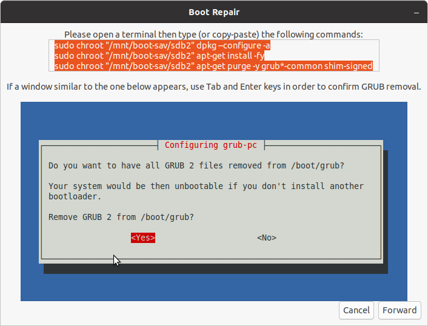

# today, problem

修复失败，重装系统。



```jsx
ubuntu@ubuntu:~$ sudo chroot "/mnt/boot-sav/sdb2" dpkg --configure -a
Setting up linux-image-5.8.0-43-generic (5.8.0-43.49~20.04.1) ...
Processing triggers for linux-image-5.8.0-43-generic (5.8.0-43.49~20.04.1) ...
/etc/kernel/postinst.d/initramfs-tools:
update-initramfs: Generating /boot/initrd.img-5.8.0-43-generic
blkid: /lib/x86_64-linux-gnu/libblkid.so.1: version `BLKID_2_37' not found (required by blkid)
blkid: /lib/x86_64-linux-gnu/libblkid.so.1: version `BLKID_2_37' not found (required by blkid)
blkid: /lib/x86_64-linux-gnu/libblkid.so.1: version `BLKID_2_37' not found (required by blkid)
W: Couldn't identify type of root file system for fsck hook
E: /usr/share/initramfs-tools/hooks/udev failed with return 1.
update-initramfs: failed for /boot/initrd.img-5.8.0-43-generic with 1.
run-parts: /etc/kernel/postinst.d/initramfs-tools exited with return code 1
dpkg: error processing package linux-image-5.8.0-43-generic (--configure):
 installed linux-image-5.8.0-43-generic package post-installation script subprocess returned error exit status 1
Errors were encountered while processing:
 linux-image-5.8.0-43-generic

ubuntu@ubuntu:~$ sudo chroot "/mnt/boot-sav/sdb2" apt-get install -fy
Reading package lists... Done
Building dependency tree       
Reading state information... Done
The following packages were automatically installed and are no longer required:
  libfile-readbackwards-perl linux-headers-5.8.0-41-generic
  linux-hwe-5.8-headers-5.8.0-41 linux-image-5.8.0-41-generic
  linux-modules-5.8.0-41-generic linux-modules-extra-5.8.0-41-generic
Use 'sudo apt autoremove' to remove them.
0 upgraded, 0 newly installed, 0 to remove and 216 not upgraded.
1 not fully installed or removed.
After this operation, 0 B of additional disk space will be used.
Setting up linux-image-5.8.0-43-generic (5.8.0-43.49~20.04.1) ...
Processing triggers for linux-image-5.8.0-43-generic (5.8.0-43.49~20.04.1) ...
/etc/kernel/postinst.d/initramfs-tools:
update-initramfs: Generating /boot/initrd.img-5.8.0-43-generic
blkid: /lib/x86_64-linux-gnu/libblkid.so.1: version `BLKID_2_37' not found (required by blkid)
blkid: /lib/x86_64-linux-gnu/libblkid.so.1: version `BLKID_2_37' not found (required by blkid)
blkid: /lib/x86_64-linux-gnu/libblkid.so.1: version `BLKID_2_37' not found (required by blkid)
W: Couldn't identify type of root file system for fsck hook
E: /usr/share/initramfs-tools/hooks/udev failed with return 1.
update-initramfs: failed for /boot/initrd.img-5.8.0-43-generic with 1.
run-parts: /etc/kernel/postinst.d/initramfs-tools exited with return code 1
dpkg: error processing package linux-image-5.8.0-43-generic (--configure):
 installed linux-image-5.8.0-43-generic package post-installation script subprocess returned error exit status 1
Errors were encountered while processing:
 linux-image-5.8.0-43-generic
E: Sub-process /usr/bin/dpkg returned an error code (1)
ubuntu@ubuntu:~$
```


[](today,%20problem%20c0b7b0aa0d174ace96cb0e767a1e0b80/Untitled%2010979a5648504ae5bdf05708dd8df810.md)

[log2](today,%20problem%20c0b7b0aa0d174ace96cb0e767a1e0b80/log2%20c9f2ec801fb644a0960a384d0abef605.md)