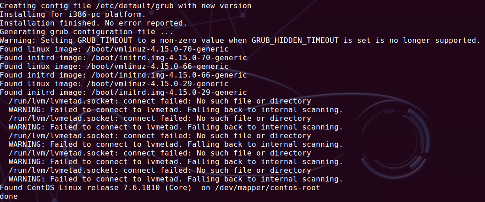

# 开机进入了memtest

tag: grub repair

一开机就进入了memtest，退出了仍然进来。

使用Ubuntu的U盘启动（try ubuntu），sudo -i进入root权限，挂载原来的Ubuntu系统盘，修改boot选项，'2'改为'0'。

重启，能够进入Ubuntu，但双系统中的CentOS看不见。

> 当时只是切换下单屏双屏设置，然后就crash了。
原来的'2'应该是对应Ubuntu，'0'是对应CentOS？
> 

---

使用Boot Repair

[Boot-Repair](https://help.ubuntu.com/community/Boot-Repair)



```jsx
Boot successfully repaired.

Please write on a paper the following URL:
http://paste.ubuntu.com/p/QBQRBYjyfx/

In case you still experience boot problem, indicate this URL to:
boot.repair@gmail.com or to your favorite support forum.

You can now reboot your computer.

The boot files of [The OS now in use - Ubuntu 16.04.6 LTS] are far from the start of the disk. Your BIOS may not detect them. You may want to retry after creating a /boot partition (EXT4, >200MB, start of the disk). This can be performed via tools such as gParted. Then select this partition via the [Separate /boot partition:] option of [Boot Repair]. (https://help.ubuntu.com/community/BootPartition)
```