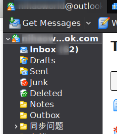
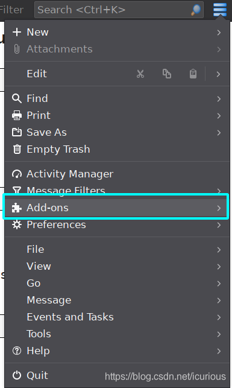
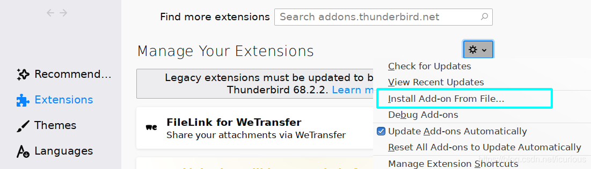
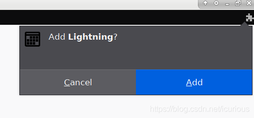
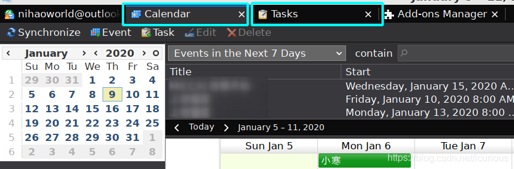
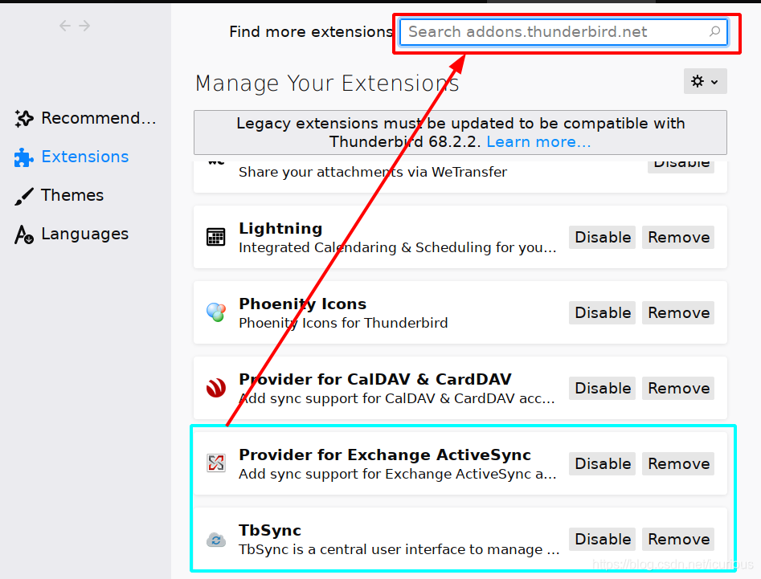
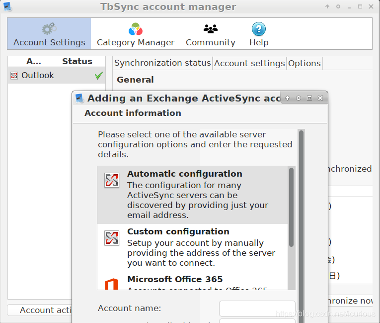

# 2020-01-09-借助ThunderBird使用和同步Exchange日历__TFBoy的小茶馆-CSDN博客

[https://blog.csdn.net/icurious/article/details/103901473](https://blog.csdn.net/icurious/article/details/103901473)

### 文章目录

# 问题

- 希望在Linux下使用Outlook日历和微软日程
- 假设你使用的是Linux系统, 并且已经下载了ThunderBird (Ubuntu自带的邮箱软件)

# 下载Lightning Calendar插件

[https://www.thunderbird.net/en-US/calendar/](https://www.thunderbird.net/en-US/calendar/)

# ThunderBird安装

- 
    
    打开ThunderBird, 配置登录自己的微软邮箱, 以左侧出现收件箱等为成功
    
    
    
- 
    
    设置插件
    
    
    
- [链接](https://addons.thunderbird.net/addon/lightning/)
    
    从文件中安装刚才下载的Lighting Calender文件
    
    
    
- 
    
    安装
    
    
    
- 
    
    重启即可生效
    
- 
    
    在Calender和Tasks就能分别看到日历和任务
    
    
    

# 下载Exchange同步相关插件

- 在ThunderBird扩展管理中搜索关键词Exchange
- 这里选择下载Provider for Exchange ActiveSync和TbSync
- 类似地安装和重启后生效
    
    
    
- 点击ThunderBird右下角
- 新增Account, 进行邮箱登录

- 登录后面板即可显示你的日历, 点击同步后日历和任务就会同步

# 参考

无