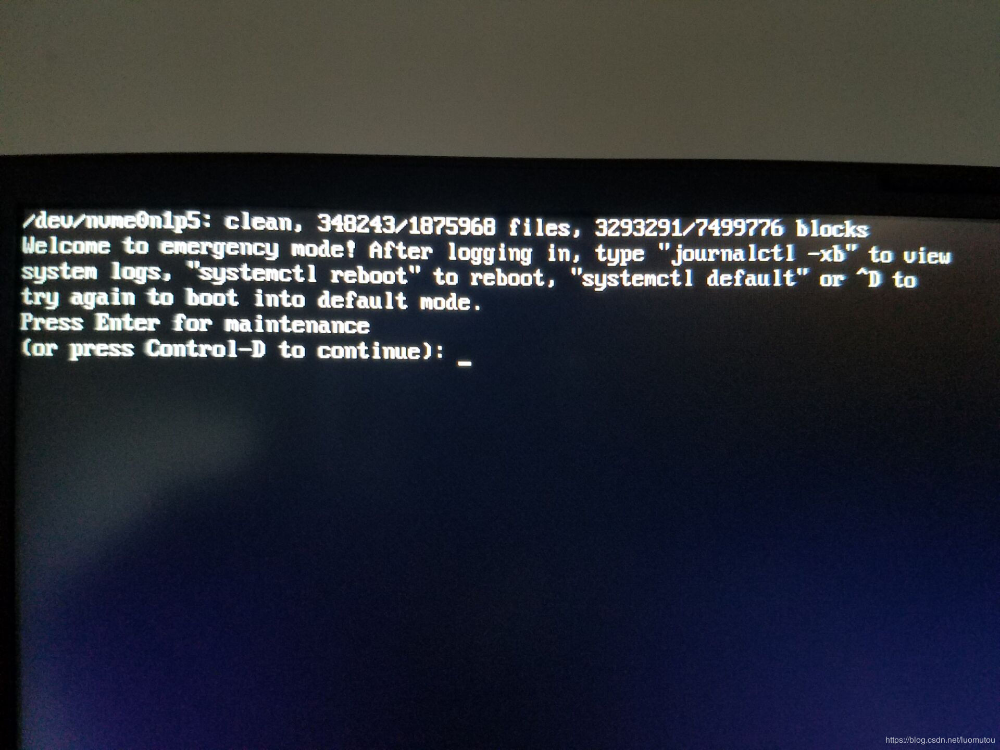
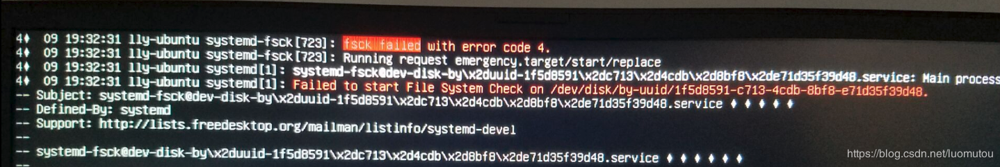
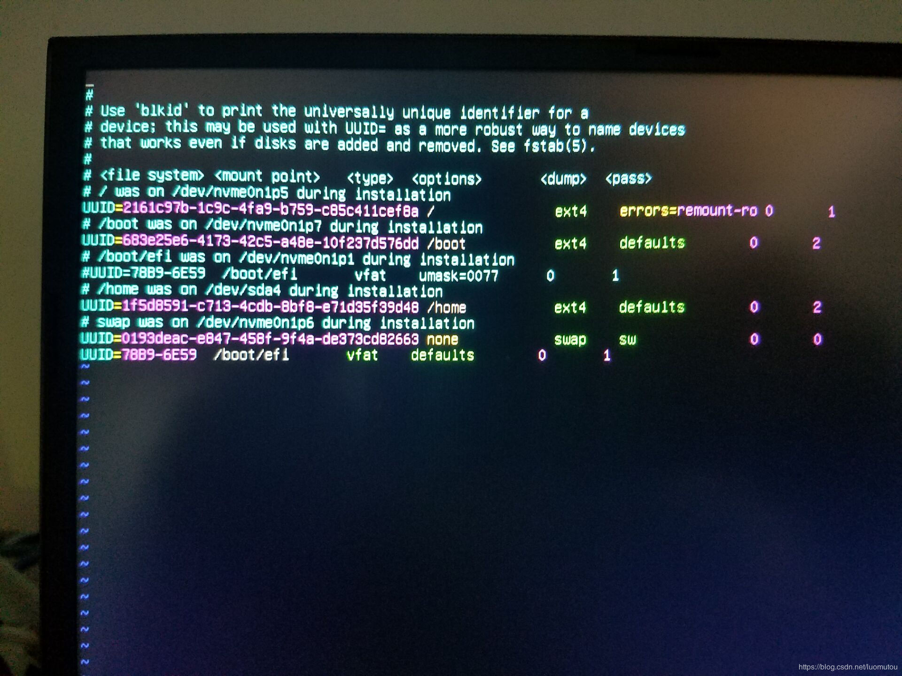

# ubuntu不能启动

[https://blog.csdn.net/luomutou/article/details/89145194](https://blog.csdn.net/luomutou/article/details/89145194)

**一、问题描述：**

如图，Ubuntu开机后进入emergency mode，尝试systemctl reboot和systemctl default命令，均无效果。

**二、解决方法：** 1.执行命令 journalctl -xb 查看日志输出，输入"/fsck failed"，搜索关键字”fsck failed”。在错误提示信息附近可以看到错误相关的设备。如图，可以看到我出问题的分区的uuid;

2.执行命令 vim /etc/fstab 如图，根据uuid，我是/dev/sda4上的/home分区出现错误;

3.执行命令 umount /dev/sda4 （对应自己出错的设备）卸载设备; 4.执行命令 fsck -y /dev/sda4 执行fsck校验并修复文件; 5.执行命令 reboot 重启系统，问题解决。

展开阅读全文