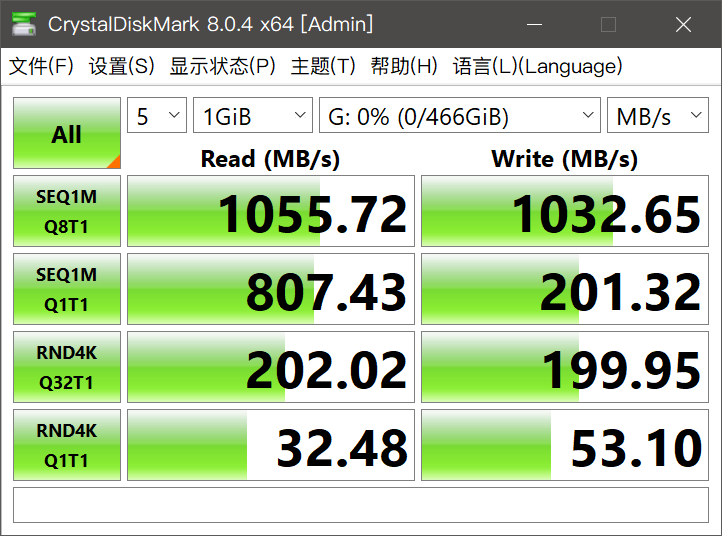
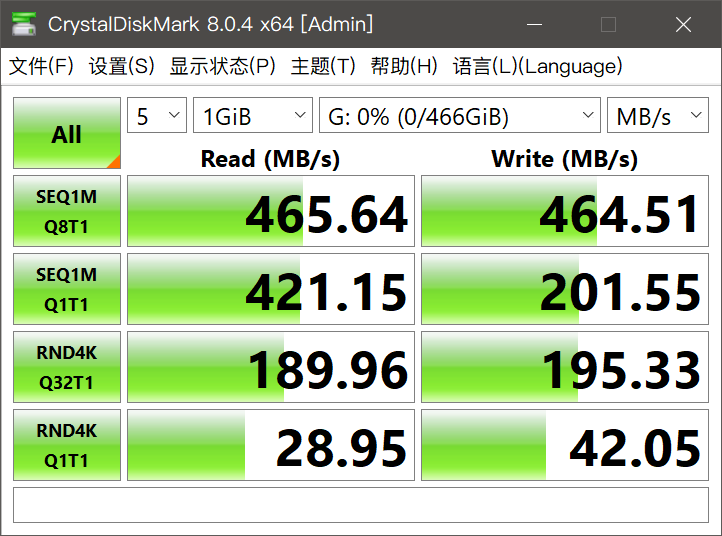
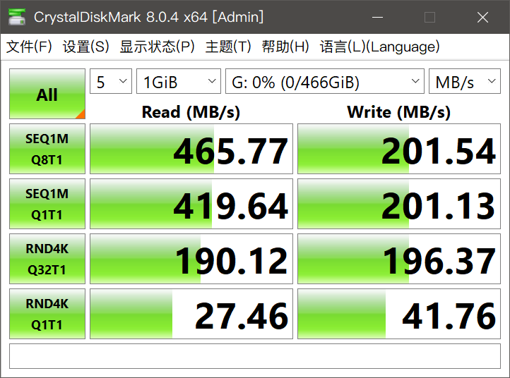

# m.2 NVME 硬盘盒，USB接口

[https://jingyan.baidu.com/article/36d6ed1faeaa761bce488310.html](https://jingyan.baidu.com/article/36d6ed1faeaa761bce488310.html)

需要格盘初始化。

测试软件：CrystalDiskMark

主机后面USB 3.0:

主机前面type c:

前面USB 2.0：

