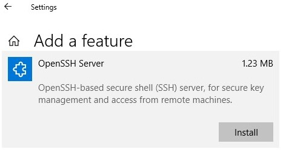
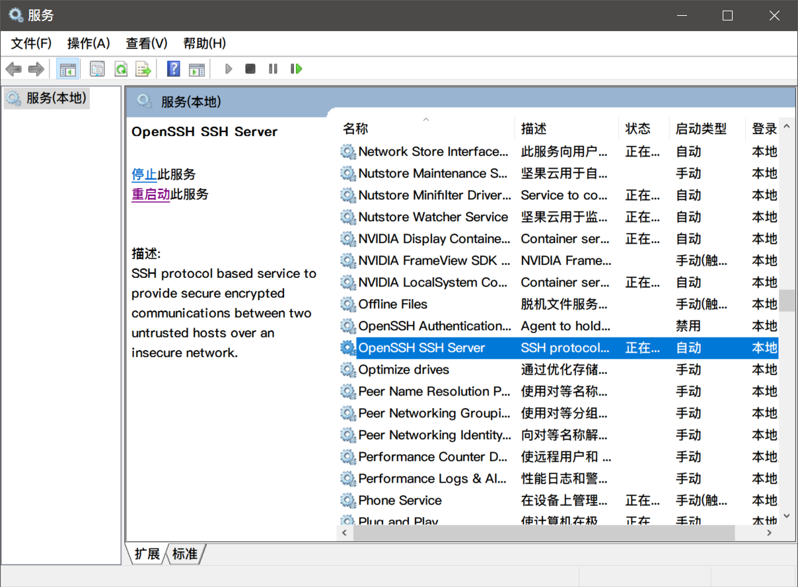

# openssh

- 安装openssh服务
    - [http://woshub.com/installing-sftp-ssh-ftp-server-on-windows-server-2012-r2/](http://woshub.com/installing-sftp-ssh-ftp-server-on-windows-server-2012-r2/)
    - [https://blog.csdn.net/weixin_43064185/article/details/90080815](https://blog.csdn.net/weixin_43064185/article/details/90080815)
    
    
    
    启动ssh：`net start sshd`
    
    让sshd服务开机自动起来。
    
- 问题：添加Mac公钥到win10后（authorized_keys），连接还是提示密码。
    - 需要修改sshd_config，然后重启sshd服务。
    - [http://woshub.com/using-ssh-key-based-authentication-on-windows/](http://woshub.com/using-ssh-key-based-authentication-on-windows/)
    - 以管理员身份运行cmd，然后notepad编辑配置文件`C:\ProgramData\ssh\sshd_config`，注释掉以下两行
        
        ```jsx
        #Match Group administrators
        # AuthorizedKeysFile __PROGRAMDATA__/ssh/administrators_authorized_keys
        ```
        
        重启sshd服务：
        
        
        

## ssh连接到cygwin

比如外部客户端是Mac电脑，要连接到win10，而且是它上面的cygwin。因为win10默认连接上后是使用自带的cmd，贼难用，主目录则是C:/Users/<user>。现在cygwin安装到了D:/cygwin64，主目录是D:/cygwin64/home/<user>。

思路：Mac先连接到win10（openssh），然后再同一机器上ssh连接到cygwin。

上面已经开好了openssh，使用默认端口22，Mac已经能够连接。

cygwin系统里面再独立开一个ssh server即可，使用不同的端口号，比如2222。

参考：[https://gist.github.com/roxlu/5038729](https://gist.github.com/roxlu/5038729)

```jsx
# 进入cygwin后
ssh-host-config
```

修改默认端口：

```jsx
vi /etc/sshd_config

Port 2222
```

启动ssh服务：

```jsx
net start cygsshd
```


使用win10自带的cmd先连接下cygwin

```jsx
ssh A@localhost -p 2222
```

---

Mac可以设置跳板机：

```jsx
Host lzy-home
        HostName 192.168.0.108
        User A

Host lzy-cygwin
        HostName localhost
        Port 2222
        User A
        ProxyJump lzy-home
```

进入到cygwin之后是原生的shell，可以切换到zsh，如何默认自动化？